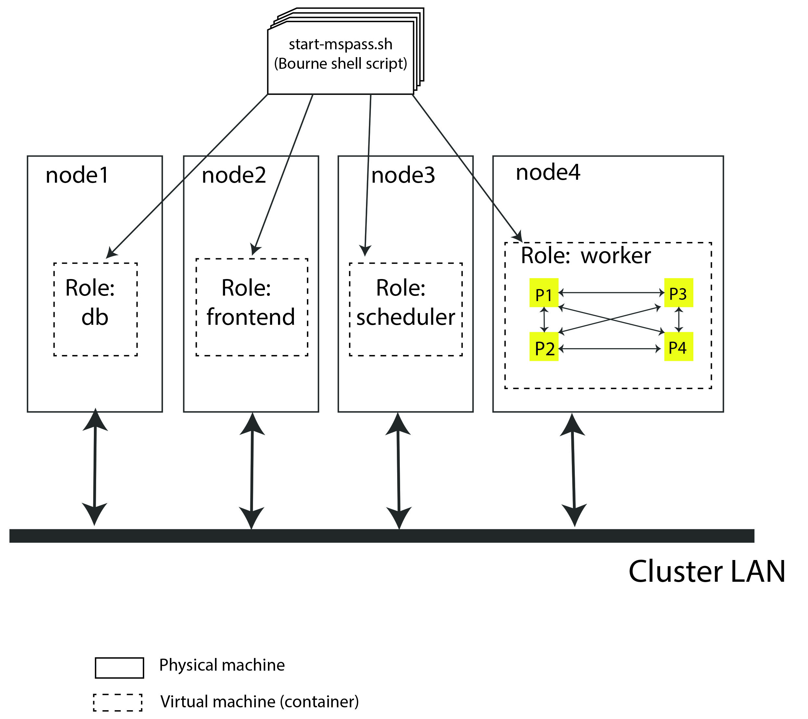
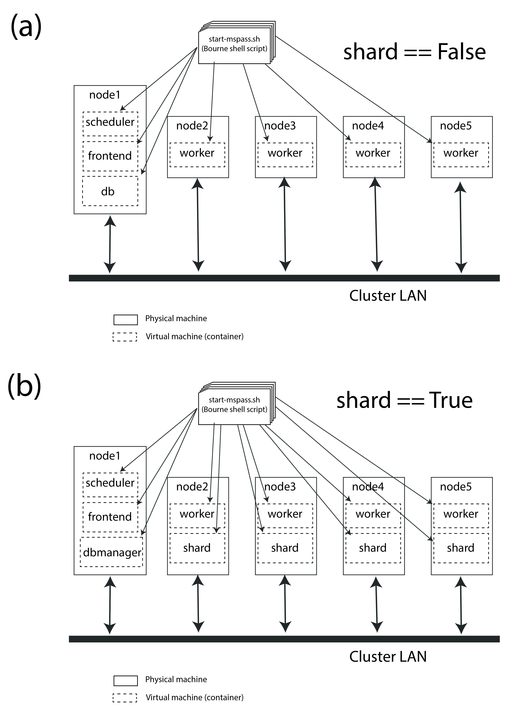
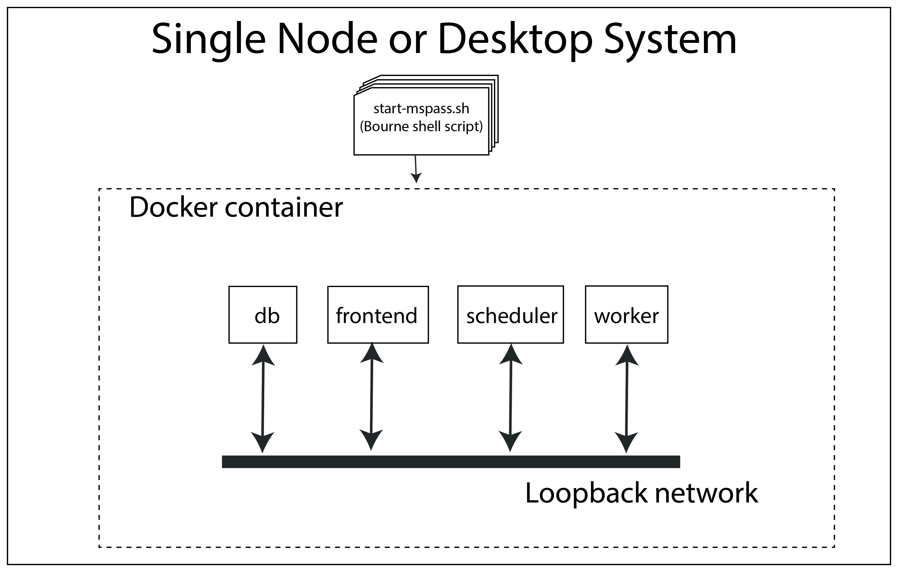

.. _getting_started_overview:

MsPASS Setup Overview
=======================

Audience
~~~~~~~~~~~~~~
This section is mainly for user's new to MsPASS.  Those readers
may find the general issue about HPC concepts helpful, but
how helpful will be entirely dependent upon the background of the reader.
Parts of this section will also
be of use to experienced users needing to configure MsPASS for
new system.  If that is you, then you will more likely want to
skip to the configuration section titled
"TACC-Stampede2 Example Implementation".

All readers should note this section leans heavily on several more
specialized sections for specific environments.   That is, a
primary design goal of MsPASS was scalability.   MsPASS is known to
allow prototyping a workflow on a desktop system or head node in an HPC system
and then porting the same python script with minimal changes to run on
a cluster with hundreds of cores.  To make that work, however,
requires some up-front work to tell the system how to deal with a
range of differences that define the system dependencies.
An idea we will use repeatedly below is that the configuration
process is used to build a *virtual cluster*.

Finally, for readers new to MsPASS we advise you to consider
reading the :ref:`introduction` section at the same time
your read the section here titled :code:`Fundamental Concepts`.
We created these sections to help you understand some
of the fundamentals that shaped the design of MsPASS.
That background can help you understand this section.

Fundamental Concepts
~~~~~~~~~~~~~~~~~~~~~~~~

Range of Hardware to run MsPASS
----------------------------------
The most basic issue that created a need for a framework like MsPASS
is a fundamental change in computing that began more than 20 years ago.
That is, prior to that time a computer was synonymous with a single cpu
and an associated set of hardware to feed the processor.  Today only
antique desktops have only a single cpu.   Multicore processors are
now universal other than for specialized hardware like low-power data
loggers.  The worlds largest "supercomputers" (alias HPC system or cluster)
have thousands of nodes and tens of thousands of cores, noting that
sentence is likely to become quickly out of date as the upper limit
grows yearly.  A special form of computer cluster is what is
now called :code:`cloud` computing.  Cloud systems add a few
special constraints and abstractions, but are fundamentally
the same as an HPC cluster in the sense both are a single entry point
to a large array of cores.
Readers who are unfamiliar with the terminology
here of *core*, *multicore*, *node*, *multiprocessor*, and
*cloud computing* are
encouraged to do an internet search on these terms before continuing.
The terms encapsulate some key concepts we assume throughout this user
manual.

Why is this issue important for seismology?   The reason is that
all of the most common data analysis tools in our field were developed
prior to the multiprocessor revolution.   Packages like SAC and
the Datascope offline data analysis components of Antelope
(Antelope's real-time system is an exception) are all fundamentally
"single-threaded", which is another way of saying they can only use
one cpu in a system at a time.   Anyone who has tried to process
large data volumes with SAC or Datascope will understand what a
severe throttle they impose on what is feasible.

There is one final key point all users must understand about
the role of parallel processing versus desktop processing.
A concise summary is this:  if the processing requires human
intervention it probably should not be done on a cluster.
That means interactive graphics
or any text response within a workflow.
The reason, of course, is that human response time to any event
is at least 9 orders of magnitude slower than a cpu clock cycle.
We thus assume the batch model of processing for HPC and cluster systems
wherein a "job" is submitted to a global scheduling system for the cluster.
Workflows requiring interactive graphics or other human interaction
are normally best run on the HPC "head node" or move the relevant
data to your desktop.  Note a key word above is *interactive* graphics.
Workflows that generate saved graphics are required as end products of
many workflows and are more than possible through multiple mechanisms.
Alternatively, some institutional setups may allow interactive work on your desktop computer
accessing the data through a cloud file system, which would have
very different performance and use restrictions.  A key point
is that MsPASS can fill all these roles, but there is a configuration
step to run each component in your local computing environment.

Containers
-------------
The enabling technology that allows MsPASS to be readily run on a wide variety
of platforms is subset of the concept of :code:`virtual machine` or
:code:`virtualization`.   If you are unfamiliar with this topic,
an internet search will yield all the sources you can ever have the
stomach to read.   MsPASS uses a specialized virtual machine
commonly called a :code:`container`.  Those who, to use a modern cliche, want to get
into the weeds, on this topic may want to read
`this article<https://kodekloud.com/docker-introduction-for-beginners-new-updated/?utm_source=google&utm_medium=&utm_id=16440672657&utm_content=&utm_term=&creativeId=&gclid=EAIaIQobChMI_-GBhLXN9wIVTcmUCR3UYw0YEAAYAiAAEgJ6CfD_BwE&gclid=EAIaIQobChMI_-GBhLXN9wIVTcmUCR3UYw0YEAAYAiAAEgJ6CfD_BwE>`__

MsPASS currently supports two container technologies:

#.  `docker<https://docs.docker.com/>`__ is the container software
    supported by MsPASS.  It is the tool of choice for desktop systems.
    It requires installing a client on your desktop system called,
    appropriately for this use, `docker desktop<https://docs.docker.com/desktop/>`__.
    The links above contain secondary links to doownload pages and installation
    instruction for the package.
#.  For HPC systems we use a standard package found all all HPC systems
    we know of called :code:`singularity`.  If you are reading this to
    adapt MsPASS to an HPC system there is probably a web page describing
    singularity and local use.   If not, there are numerous sources on the
    web.  A simplistic perspective is that singularity is docker for
    an HPC system.   It has command line tools similar to those for
    docker desktop and runs containers built on docker hub directly.
    In addition, a fundamental property of singularity is that it runs docker
    containers directly.

Current cloud systems support docker containers.   That is, there is a system
dependent procedure to "pull" the MsPASS container but once loaded the container
is used directly to run your job.

The key point about containers, in general, is that a container eliminates
the long list of system dependency issues that arise with conventional
software installation.   It also allows MsPASS to run on any operating
system that can support a docker container running an x86 (intel processor)
container.  Additional hardware support is possible.  For instance, at
this writing we have an experimental container to run on
machines using Apple's new ARM chip.
That may be available by the time you read this.

Foreman-worker Model
--------------------------
A foundational concept of MsPASS is the foreman-worker model of
parallel processing.  (Some sources will use the less politically correct
term master-slave to describe the came concept.)
The idea is simple and intuitive to anyone who has tried to organize a
group of people.   If you have big job to do that you couldn't possibly do
yourself, you break the job into a set of manageable tasks.   The
foreman (aka project manager or master) assigns tasks to workers (slaves)
as schedule dictates.  Dependencies always exist wherein when a worker finishes
one task he/she has to pass the result on to another.  Three key concepts
that appear throughout this user's manual are direct consequences of this model:

#.  The :code:`foreman` is what we also call a :code:`scheduler`.   That piece
    of software is the boss whose only job is to assign work.
#.  A :code:`worker` is a single-minded individual who only does what the
    :code:`foreman` tells him/her to do (That is why "slave" is sometimes used to describe
    the concept.).
#.  The :code:`foreman` needs to communicate with the workers to tell them
    what to do.   Less obvious is the fact that all the workers also need
    to communicate with each other as well as the foreman.   The reason is
    that the most common paradigm is worker A finishes task X and passes
    the result to to worker B to do task Y where in our case X and Y
    are two different processing algorithms.  As a result interprocesses
    communication is a fundamental requirement to make processing with the
    foreman-worker model possible.

Schedulers
----------------
As noted a number of other places in this user's manual MsPASS
achieves parallelization in a cluster through one of two
schedulers called `dask<https://dask.org/>`__
and `Spark<https://spark.apache.org/>`__.  Both achieve parallellism
by running a series of processes on cores to which the software
has access.   More details about how these packages do
scheduling to achieve parallelism can be found in
the links above and a variety of online sources and published books.
This section addresses the issue of configuration of MsPASS.
For that purpose, you need to understand the following points about
setting up dask or spark on a cluster:

#.  Most clusters are shared facilities with many simultaneous users.
    All cluster use some form of higher level scheduler to schedule
    "jobs", which is the modern ancestor of batch systems developed for
    "mainframe computers" in the 1960s.   A "batch job" means you
    submit a script of command line instructions to run your application(s)
    on the system.   Hence, the first thing to understand is that to run
    MsPASS on a cluster will normally require preparing that script of
    instructions.   Part of that script is instructions to the batch
    scheduler (the software called Slurm in our example below). The
    batch scheduler has to be told how many nodes and/or cores the
    job will require and often other resources like minimum memory needs or
    access to auxiliary resources not required by all jobs.  You then
    "submit" your job script to a "queue".  The batch scheduler then determines
    when the cluster has sufficient resources available for the time period
    you define to run your "job".  Do NOT confuse the issue of scheduling
    a set of nodes for a "job" with the "scheduling" done by Dask/Spark.
    They are very different things that both utilize the same English word
    in their definitions.
#.  Once a "job" has been scheduled on a cluster task-level scheduling in
    MsPASS is controlled by `dask<https://dask.org/>`__
    or `Spark<https://spark.apache.org/>`__.   Either require additional
    configuration setup that tells the software what environment it is
    running in and how many workers it should define for the job.
    A less obvious issue with using Spark or Dask is the need to define
    communication channels between tasks. Both packages use the modern
    concept of abstracting what "interprocess communication" means.
    You have no control of what this means for communication
    between processes running on a single node.  In contrast,
    communication between nodes on HPC systems normally requires
    some configuration.   The reason is that a "job" is assigned a set of
    nodes (physical machines) by the job scheduler and your script (job) cannot
    know the network address of those nodes until the job scheduler has
    assigned them.   For that reason we will see below the configuration
    scripts for HPC setups need a mechanism to ascertain what physical
    nodes are being used and set up communication channels between them
    manually.

MongoDB
------------
What MongoDB is, why is chosen for MsPASS, and how it is used in MsPASS are
topics discussed throughout this User's Manual.   Two key sections on this
topic are :ref:`database_concepts` and :ref:`CRUD_operations`.
The purpose of this section is to clarify several more basic concepts
that may help you understand the configuration requirements needed to
make MongoDB functional on a cluster.

#.  MongoDB like most modern database engines acts in a client-server
    arrangement.  Your application acts as a client and MongoDB is
    running a service that defines its role as a "server".
#.  Like most servers we have to launch MongoDB as a daemon.  That
    could be done using standard linux methods for launching daemons when the
    virtual machine in the container boots.  That approach would not work
    for MsPASS, however, as when multiple containers are running, which
    is the norm, the multiple instances would collide.   For that reason
    our setup launches MongoDB manually only on (virtual) machines
    defined in the configuration.
#.  The MongoDB server communicates with clients through a network
    connection.   As a result a critical configuration parameter is
    the IP address and port number
    (If you aren't familiar with IP numbers and ports there are may
    internet sources on this topic.
    `This one<https://www.techtarget.com/searchnetworking/definition/port-number>`__
    is a good starting point.)  of the node(s) running the MongoDB server.
#.  MongoDB has a feature they call
    `sharding<https://www.mongodb.com/docs/manual/tutorial/deploy-shard-cluster/>`__.
    The purpose of sharding is to distribute data on multiple nodes of a
    cluster to improve performance.   The reason that can be a good idea
    with database intensive operations is database transaction in any
    database system can be very slow compared to the compute time of the
    algorithm driving the transactions.  That fundamental fact
    means if your workflow requires extensive database operations
    that are a bottleneck, sharding is a potential solution.  MsPASS
    supports sharding using MongoDB native setup.   That is, turning on
    sharding is a configuration option.

Frontend
------------

The standard MsPASS container assumes the use of a
`jupyter notebook<https://jupyter.org/>`__`
to assemble and test your workflow.  As noted elsewhere
(NEEDS A LINK TO A NEW SECTION ON REPRODUCIBLE SCIENCE and notebook constraints)
we believe jupyter notebooks can be used to encourage reproducible
science.   We use a jupyter notebook service to define the
role we call :code:`frontend`.  The concept of the :code:`frontend`
is the abstract box that communicates directly with you as the user.
The process of driving a jupyter notebook is well documented
on many internet pages so if you are now familiar with jupyter notebook
we advise you to find a good tutorial on the topic before you try to use
MsPASS.

For this overview it is important to stress that the expectation is
that you will use jupyter notebook in two ways:

#.  Jupyter is an effective tool to assemble and test your python
    code (your workflow) on a desktop or interactive node in an HPC cluster.
    The thing jupyter allows that goes far beyond contentional code comments
    is the ability to insert full-featured text as "markdown" boxes between
    code blocks.   Our
    `tutorials<https://github.com/mspass-team/mspass_tutorial/tree/master/notebooks>`__
    all use this approach and demonstrate this
    fundamental idea.

#.  When you have a functional workflow you want to run on a large cluster
    to process a full dataset, MsPASS has a feature to run the notebook
    from the batch job script (see below) using a command line argument.

Perhaps the most important feature of this model is you can and should plan
to publish your notebook to allow other scientists to reproduce your work
as a near turnkey operation.  A notebook that can be run this way has some
restriction described in our user's manual (LINK TO NEW SECTION)

MsPASS Configuration
~~~~~~~~~~~~~~~~~~~~~~~~~~

Overview
------------
To understand how to configure MsPASS it is important to first
understand some fundamental concepts that are treated as abstractions.
You can think of the configuration as making the abstractions concrete.

#.  The MsPASS framework is generic and has to be informed about
    that actual physical configuration.   How much it can determine automatically
    and what it needs to be told manually are system dependent.
#.  As much as possible we abstract all IO.   Input means you use a handle of
    some kind to create some data object.   Output means you use a handle to
    save that data in a form that allows it to be reconstructed later.
    Whether that is done by reading from a file on file system, a file
    on a HPC disk farm, a cloud system via a URL, or something not yet invented
    is irrelevant.  All that matters is that you have a software handle to
    manage the reads and writes.
#.  A special case of IO is interprocess communication.   Spark and Dask
    both abstract that process in a manner opaque to you as a user.
    This allows them to automatically determine if a connection is
    process-to-process within a shared memory environment (within a node)
    or between nodes.   Mechanisms for the first are varied.  For the later
    it means network communications between two processes on two nodes with the cluster's
    internal network.
#.  We made a design choice in MsPASS to further abstract the overall system
    in terms of one a finite set of functional blocks we refer to as the
    blocks :code:`role`.   There are three core "roles" any MsPASS
    setup needs to define:  (1) :code:`scheduler`, (2) :code:`worker`,
    and :code:`db`.  Sharding adds a level of complexity.  When sharding is
    enabled two additional function "roles" are required we call
    :code:`dbmanager` (replaces :code:`db` in a sharded environment) and
    :code:`shard`.  Finally, we define the role of :code:`frontend`
    as an abstraction of the user interface.  Sections below will
    provide more details on what these different "roles" mean and how
    they are used.

A final point for this overview is that a good summary of the purpose of
configuration is to define a virtual cluster in which your job should be run.
The scalability of MsPASS is possible because of the abstraction that
allows the definition of a virtual cluster.  How complicated that
configuration will be is dependent upon what you are building.
We have a turnkey system for a desktop system, but any other cluster will
require a nonzero commitment to configure and run jobs in the virtual
cluster you define.  MsPASS is a "framework" which means it can handle complex
definitions, but it will not produce a workable system
until someone adds a skin to the framework.

We first consider a series of example configurations that we illustrate
using abstractions we described immediately above.   After
the examples we turn to the implementation detail of how we
make an abstract model concrete.

Example 1:  Simple four node virtual cluster
-----------------------------------------------
Figure :numref:`Configuration_figure1` is
a block diagram of a virtual cluster that is largely useful
only for it's pedagogic value.   i.e. we show it
as an introductory example to help further demonstrate key
concepts and how they fit together.  The actual configuration here would
not be very prudent because it would not make efficient use of resources for
reasons we discuss at the end of this section.

.. _Configuration_figure1:

     :numref:`Configuration_figure1`.  Block diagram showing abstract components of the virtual cluster
     configuration of example 1.  This example assumes four physical
     nodes illustrated by the four larger boxes with solid lines.
     The dashed line boxes define virtual machines running within
     each physical node.   Each physical node is illustrated as
     connected to a high speed LAN used for node-to-node communication
     in the cluster.

This simple example is helpful to clarify some important implementation
details that we use in MsPASS to define a virtual cluster:

- The fundamental components are defined by what we call a :code:`role`.
  In this example there are four:  :code:`db`, :code:`frontend`,
  :code:`scheduler`, and :code:`worker`.  Those names define the
  following:

  * The :code:`db` virtual machine runs MongoDB.
  * The :code:`frontend` virtual machine is running a jupyter  notebook
    service.   That is currently the default user interface for MsPASS.
  * The :code:`scheduler` virtual machine runs the dask or spark scheduler.
  * The :code:`worker` virtual machine runs a dask or spark worker.

- The configuration is all driven by a master script illustrated at the top
  of the figure with the tag "start-mspass.sh".  Because our container
  runs a version of linux that script is a Bourne (bash) shell script.
  We discuss the contents of that script below.

- This example shows a simple configuration with one virtual machine per
  physical node.  However, it also shows that the worker node is configured
  with four processes labeled P1, P2, P3, and P4.  Note our terminology
  has created an ambiguity of language in the current setup you need to
  understand.  A single instance of a virtual machine (container) is
  run with its "role" defined as :code:`worker` but both dask and spark,
  by default, will define one worker process per core defined for that
  virtual machine.  i.e. "worker" is used for two different contexts here.
  It means a "role" and the worker being directed by a foreman (scheduler).
  In retrospect we should have used a different work to define the worker
  as a role, but for the present that ambiguity is too deeply embedded in
  the code base to easily excise it.

- The worker node has lines with arrows drawn between the four boxes labeled P1, P2, P3, and P4.
  Those lines symbolize interprocess communication between the worker processes.
  As noted above dask and spark abstract that communication.

- We illustrate node-to-node communications through a common symbol for a
  local area network.  That is, the heavy line labeled "Cluster LAN".
  A key point here is that such communications use a physical connection
  between nodes and the nodes operating system has to handle routing
  data traffic to and from the virtual machine it is running.

- Figure :numref:`Configuration_figure1` has node2 running with a
  role set as :code:`frontend`.   As noted earlier the :code:`frontend` box is an
  abstraction of a user interface but in our implementation it runs the
  service that allows a web browswer to connect to the virtual cluster
  by running a jupyter notebook on your local machine.   NEEDS MORE AFTER MEETING

Before continuing it is worth noting why this simple configuration is
useful for understanding but likely a bad idea for an actual configuration,
The example is useful because of simplicity.  In this example each
node has one and only one "role".   The examples below show that isn't
essential, but does introduce some potentially confusing complexity we
think is important to consider independently.   Why this configuration
would almost certainly be a "bad idea" for an actual implementation is
inefficiency.   All but archaic clusters today have multicore nodes.
Dedicating a full node to each "role" would waste resources.  The most
extreme is the :code:`frontend` box that in our implementation launches a
virtual machine dedicated only to running a jupyter notebook server.
The jupyter notebook server is a very lightweight process tha consumes very
few resources.   A run in this cofiguration would show node2 nearly idle
for an entire run.   In contrast, we have found devoting a node to
the :code:`scheduler` role may often be prudent.   The key point here is
that "fine-tuning" of a production workflow may require some
benchmark tests for load balancing.  On the other hand, we also caution
all users to keep your objectives in mind.   If you are doing a one-up
workflow for a research project fine-tuning configuration would be
a waste of your time.  If you face a task with months of compute time, however,
some fine-tuning may be justified.

Example 2:  Multiple nodes with multiple roles`
---------------------------------------------------
Figure :numref:`Configuration_figure2` is
a block diagram of a virtual cluster that is a minor variant of
that in Figure :numref:`Configuration_figure1`.   This configuration
has less of the inefficiency of that in Figure :numref:`Configuration_figure1`
by not dedicating a node to the :code:`frontend` role.  It also
illustrates a more subtle point that is an implementation detail
we were avoiding in Example 1.   That is, note that when a node is
set up to run multiple "roles" each role is run in a  separate
virtual machine (container).  We emphasize that is an
"implementation detail" we made to simplify the already complicated
start-mspass.sh script.  We note that approach would have been a bad
idea with older "virtual machine" software that would require loading a
full implmentation of a guest operating system into memory, but
this is an example of the merits of a "container" version of virtualization.
The approach we used is common and is not particularly onerous in
the consumption of system resources.  The key differences between this
and example 1 are:

#. Nodes 1 and 2 are both running two containers with different "roles".
#. Node 2 illustrates a different configurable feature that can be used to
   provide better load balancing.   That is, it is possible to launch
   a container running with the role of :code:`worker` and limit the number
   of workers that scheduler can assign.  This example shows the node 2
   worker with only 2 processes while the node dedicated to workers (node 3)
   is assigned 4 worker processes.

.. _Configuration_figure2:

.. figure:: ../_static/figures/MultipleRolesPerNode.jpg
     :width: 600px
     :align: center

     :numref:`Configuration_figure2`.
     Block diagram showing abstract components of the virtual cluster
     configuration of example 2.  This example shows a cluster with
     three physical nodes running containers with multiple roles on two of the three
     nodes.  See the caption of Figure :numref:`Configuration_figure2`
     for details on the meaning of different lines in the diagram.

Example 3:  Multiple nodes with optional Sharding
-----------------------------------------------

Figure :numref:`Configuration_figure3` is the first example
that is known to give reasonable load balancing on an HPC system.
It is, in fact, a schematic diagram of our example configuration for
creating a virtual cluster at TACC.   A configuration file that would
create this virtual cluster is given below.   The most up-to-date
version can be found
`here<https://github.com/mspass-team/mspass/blob/master/scripts/tacc_examples/distributed_node.sh>`__ on github,
but be warned that copy is subject to version skew from that pasted
here to create this user manual section.

.. _Configuration_figure3:

     :numref:`Configuration_figure3`.
     Block diagram showing abstract components of the virtual cluster
     configuration of example 3.  This example shows a cluster with
     five physical nodes that define alternative operational modes
     in our example "distributed node" script.  (a) shows a configuration
     without MongoDB sharding enabled.   In that case node  1 has a
     container running a single instance of MongoDB (box labeled db).
     Node 1 also has two other containers: one running with role
     :code:`scheduler` and another running with role :code:`frontend`.
     (b) shows a similar configuration that would be created with the
     configuration script if shading is enabled.  Note that in that
     situation the :code:`db` box is assigned the role :code:`dbmanager`.
     The :code:`dbmanager` coordinates database transitions with the
     shards defined in the other nodes.  In this example each node running
     a worker container also runs a container with a role defined as
     :code:`shard`.

This figure actually illusrates two different configurations.   We consider
them together because the script that could be run at TACC to create this
virtual cluster has an option for turning MongoDB's "sharding" feature (see above
and the MongoDB documentation) on and off.  Consider first the case with
sharding False (off) as it has much in common with example 2.  Some key
points about the case with sharding off are the following:

*  In this case we have four dedicated worker nodes and put all the other
   required "roles" in a single node.
*  As in example 2 all each container runs one and only one role.
*  We don't illustrate the worker processes in this figure for simplicity.
   We note that both dask and spark will default to creating one worker
   process per core assigned to the container.   In this configuration that
   would normally mean all the cores of that node.  Thus if each node had,
   for example, 16 cores, this virtual cluster would represent a 64 processor
   engine.

Whether or not this configuration is well balanced depends upon the
workflow and the physical nodes on which it is run.
Putting the database server on the same node as the scheduler
could cause issues for a workflow running lots of database operations.
We show the example with sharding turned on (part b of the figure) as
an illustration of how sharding could be enabld to possibly improve load balancing
in such a situation.  Some key points about the sharding example are the
following:

*  When sharding is used we add two new MsPASS "role" definitions:
   :code:`shard` and :code:`dbmanager`.   We emphasize the "role" concept is
   a feature of MsPASS and not something you will find in the MongoDB
   documentation.   Both define configurations defined in the start-mspass.sh
   script used to launch each container.   To see exactly what each do
   look at the contents of start-mspass.sh found `here<https://github.com/mspass-team/mspass/blob/extend_normalization_options/scripts/start-mspass.sh>`__.
*  Sharding adds complexity to a setup and run time environment that
   should not be taken lightly.   In general, we would recommend avoiding
   it unless you have a production workflow you find limited by
   database transactions.   Our example below and with start-mspass.sh
   provide a starting point to implement a sharded cluster.   That should,
   however, be viewed only as a supplement the MongoDB documentation on
   sharding easily found by a web search.

Example 4:  All-in-one desktop setup
---------------------------------------
We leave the special case we call "all-in-one" until now even
though virtually all MsPASS users will likely first use it in that mode.
The reason is that although
it is implemented through the same master script (start-msspas.sh),
it is a special case that might be confusing if we had started there.
That is, because the framework is primarily designed for running on
a cluster running on a desktop has to simulate elements of cluster.
That said, the following figure illustrates an abstraction of the
all-in-one mode with symbols the same as the examples above:

.. _Configuration_figure4:

     :numref:`Configuration_figure4`.
     Block diagram showing abstract components of what we
     call the all-in-one mode used for running on a single node.
     Symbols and line styles are as with all the related figures above.

The fundamental difference to note in this run mode is all four
of the required mspass "roles" (:code:`scheduler, worker, db, frontend`)
are run in the same container.  All the previous examples used
used multiple containers with only one "role" per container.
We emphasize either choice (one role per container or multiple roles
per container instance) is an implementation detail.   The single container
mode is more efficient for a desktop.  Multiple containers are more appropriate
for clusters to make the configuration more generic.   Further, in a cluster
the minor memory overhead of multiple containers would be less of an issue
than for a single node.

A final point about this configuration is that by default both dask and
spark will define the number of process devoted to workers to be the number of
cores defined for the container.   If you are running MsPASS on a desktop
you want to simultaneously use for other purposes you may want to configure docker
to not use all the cores on the system.   That process is described
`here<https://docs.docker.com/config/containers/resource_constraints/>`__.

TACC-Stampede2 Example Implementation
~~~~~~~~~~~~~~~~~~~~~~~~~~~~~~~~~~~~~~~~~
Overview
----------
In this section we show a concrete implementation of our abstract
example 3.  This example will is known to run on the
`TACC<https://www.tacc.utexas.edu/use-tacc/getting-started>`__
system called stampede2.  On that system a package called
:code:`singularity` is used to launch and containers in multiple nodes.
Job level scheduling is handled by a system called :code:`Slurm`.
Details on how to use those two packages to run jobs are found
in two subsections of this :code:`Getting Started` section:
:ref:`run_mspass_with_singularity` provides some basics on using
singularity and :ref:`deploy_mspass_on_HPC` gives more details.
This section covers some of the same material, but relates some of the
details back to the more abstract concepts discussed above.
A practical guide is that this section of this document
is the tutorial while the other sections of :code:`Getting Started`
are reference material better used after you are familiar with the
material found here.

The subsections below give some of the details of three files
MsPASS uses to construct a virtual cluster:

#.  We show an example job control script that implements the abstract,
    five-node cluster illustrated above in :numref:`Configuration_figure3`
    for the case with sharding turned off.
#.  We cover highlights of the  :code:`start-mspass.sh` file illustrated in all
    the figures above.  As noted it is a master shell script used to
    launch a single instance of a container.
#.  We include a brief discussion of the docker configuration file.
    That discussion is not all inclusive, but it might make some
    unix shell incantations slightly less mysterious.  We emphasize that
    file has no direct role in configuration.   The issue we clarify below
    is how :code:`start-mspass.sh` is used in the container setup.

These three files are tightly connected.  The first two define
the configuration for the virtual cluster in which you run the job.
The third is important only to understand the way the contaienr is
constructed to use these two configuration files.
Understanding how they work together is much like understanding
the control flow of any piece of
computer code that has subprograms (functions).   The job script
is like a main program (function).   It defines the environment in which
the job is to be run, launches containers used to define the virtual
cluster, configures the containers, and then run the desired workflow.
The docker configuration file can be thought of as like the operating
system code:  you only interact with it, you don't change it.

Job Script
-----------------------

Because the job script is effectively the main program for any workflow
we begin with our example.  Note this script was derived from an
ancestor of the current file found on github
`here<https://github.com/mspass-team/mspass/blob/master/scripts/tacc_examples/distributed_node.sh>`__.
It differs mainly with some minor changes to match the configuration
described in this  document.   I also includes some additional comments
with the tag *Section n* used as anchors for descriptions following the
script:

.. code-block:: python

  #!/bin/bash

  #SECTION 1:  slurm commands (see below for more details)
  #SBATCH -J mspass          # Job name
  #SBATCH -o mspass.o%j      # Name of stdout output file
  #SBATCH -p skx-dev         # Queue (partition) name - system dependent
  #SBATCH -N 5               # Total # of nodes (5 for this example)
  #SBATCH -n 5               # Total # of mpi tasks (normally the same as -N)
  #SBATCH -t 02:00:00        # Run time (hh:mm:ss)
  #SBATCH -A MsPASS          # Allocation name (req'd if you have more than 1)

  # SECTION 2:  Define the software environment
  # Most HPC systems like stampede2 use a softwere module
  # manager to allow each job to define any special packages it needs to
  # run.  In our case that is only tacc-singularity.
  ml unload xalt
  ml tacc-singularity
  module list
  pwd
  date

  #SECTION 3:  Define some basic control variables for this shell
  # this sets the working directory
  # SCRATCH is an environment variable defined for all jobs on stempede2
  WORK_DIR=$SCRATCH/mspass/workdir
  # This defines the path to the docker container file.
  # like SCRATCH WORK2 is an environment variable defining a file system
  # on stampede2
  MSPASS_CONTAINER=$WORK2/mspass/mspass_latest.sif
  # specify the location where user wants to store the data
  # should be in either tmp or scratch
  DB_PATH='scratch'
  # the base for all hostname addresses
  HOSTNAME_BASE='stampede2.tacc.utexas.edu'
  # Sets whether to use sharding or not (here sharding is turned off)
  DB_SHARDING=false
  # This variable is used to simplify launching each container
  # Arguments are added to this string to launch each instance of a
  # container.  stampede2 uses a package called singularity to launch
  # each container instances
  SING_COM="singularity run $MSPASS_CONTAINER"

  # Section 4:  Set up some necessary communication channels
  # obtain the hostname of the node, and generate a random port number
  NODE_HOSTNAME=`hostname -s`
  echo "primary node $NODE_HOSTNAME"
  LOGIN_PORT=`echo $NODE_HOSTNAME | perl -ne 'print (($2+1).$3.$1) if /c\d(\d\d)-(\d)(\d\d)/;'`
  STATUS_PORT=`echo "$LOGIN_PORT + 1" | bc -l`
  echo "got login node port $LOGIN_PORT"

  # create reverse tunnel port to login nodes.  Make one tunnel for each login so the user can just
  # connect to stampede.tacc
  # Note the number used as an arg to seq should be the number of nodes in the
  # virtual cluster
  for i in `seq 6`; do
      ssh -q -f -g -N -R $LOGIN_PORT:$NODE_HOSTNAME:8888 login$i
      ssh -q -f -g -N -R $STATUS_PORT:$NODE_HOSTNAME:8787 login$i
  done
  echo "Created reverse ports on Stampede2 logins"

  # Section 5:  Launch all the containers
  # In this job we create a working directory on stampede2's scratch area
  # Most workflows may omit the mkdir ans just use cd to a working
  # directory created and populated earlier
  mkdir -p $WORK_DIR
  cd $WORK_DIR

  # start a scheduler container in the primary node
  SINGULARITYENV_MSPASS_WORK_DIR=$WORK_DIR \
  SINGULARITYENV_MSPASS_ROLE=scheduler $SING_COM &

  # get the all the hostnames of worker nodes
  WORKER_LIST=`scontrol show hostname ${SLURM_NODELIST} | \
               awk -vORS=, -v hostvar="$NODE_HOSTNAME" '{ if ($0!=hostvar) print $0 }' | \
               sed 's/,$/\n/'`
  echo $WORKER_LIST

  # start worker container in each worker node
  SINGULARITYENV_MSPASS_WORK_DIR=$WORK_DIR \
  SINGULARITYENV_MSPASS_SCHEDULER_ADDRESS=$NODE_HOSTNAME \
  SINGULARITYENV_MSPASS_ROLE=worker \
  mpiexec.hydra -n $((SLURM_NNODES-1)) -ppn 1 -hosts $WORKER_LIST $SING_COM &

  if [ "$DB_SHARDING" = true ] ; then
      echo 'Using Sharding MongoDB'
      # extract the hostname of each worker node
      OLD_IFS=$IFS
      IFS=","
      WORKER_LIST_ARR=($WORKER_LIST)
      IFS=$OLD_IFS

      # control the interval between mongo instance and mongo shell execution
      SLEEP_TIME=15

      # start a dbmanager container in the primary node
      username=`whoami`
      for i in ${!WORKER_LIST_ARR[@]}; do
          SHARD_LIST[$i]="rs$i/${WORKER_LIST_ARR[$i]}.${HOSTNAME_BASE}:27017"
          SHARD_ADDRESS[$i]="$username@${WORKER_LIST_ARR[$i]}.${HOSTNAME_BASE}"
          SHARD_DB_PATH[$i]="$username@${WORKER_LIST_ARR[$i]}.${HOSTNAME_BASE}:/tmp/db/data_shard_$i"
          SHARD_LOGS_PATH[$i]="$username@${WORKER_LIST_ARR[$i]}.${HOSTNAME_BASE}:/tmp/logs/mongo_log_shard_$i"
      done

      SINGULARITYENV_MSPASS_WORK_DIR=$WORK_DIR \
      SINGULARITYENV_MSPASS_SHARD_DATABASE=${SHARD_DATABASE} \
      SINGULARITYENV_MSPASS_SHARD_COLLECTIONS=${SHARD_COLLECTIONS[@]} \
      SINGULARITYENV_MSPASS_SHARD_LIST=${SHARD_LIST[@]} \
      SINGULARITYENV_MSPASS_SLEEP_TIME=$SLEEP_TIME \
      SINGULARITYENV_MSPASS_ROLE=dbmanager $SING_COM &

      # ensure enough time for dbmanager to finish
      sleep 30

      # start a shard container in each worker node
      # mipexec could be cleaner while ssh would induce more complexity
      for i in ${!WORKER_LIST_ARR[@]}; do
          SINGULARITYENV_MSPASS_WORK_DIR=$WORK_DIR \
          SINGULARITYENV_MSPASS_SHARD_ID=$i \
          SINGULARITYENV_MSPASS_DB_PATH=$DB_PATH \
          SINGULARITYENV_MSPASS_SLEEP_TIME=$SLEEP_TIME \
          SINGULARITYENV_MSPASS_CONFIG_SERVER_ADDR="configserver/${NODE_HOSTNAME}.${HOSTNAME_BASE}:27018" \
          SINGULARITYENV_MSPASS_ROLE=shard \
          mpiexec.hydra -n 1 -ppn 1 -hosts ${WORKER_LIST_ARR[i]} $SING_COM &
      done

      # start a jupyter notebook frontend in the primary node
      SINGULARITYENV_MSPASS_WORK_DIR=$WORK_DIR \
      SINGULARITYENV_MSPASS_SCHEDULER_ADDRESS=$NODE_HOSTNAME \
      SINGULARITYENV_MSPASS_DB_ADDRESS=$NODE_HOSTNAME \
      SINGULARITYENV_MSPASS_DB_PATH=$DB_PATH \
      SINGULARITYENV_MSPASS_SHARD_ADDRESS=${SHARD_ADDRESS[@]} \
      SINGULARITYENV_MSPASS_SHARD_DB_PATH=${SHARD_DB_PATH[@]} \
      SINGULARITYENV_MSPASS_SHARD_LOGS_PATH=${SHARD_LOGS_PATH[@]} \
      SINGULARITYENV_MSPASS_DB_MODE="shard" \
      SINGULARITYENV_MSPASS_ROLE=frontend $SING_COM
  else
      echo "Using Single node MongoDB"
      # start a db container in the primary node
      SINGULARITYENV_MSPASS_DB_PATH=$DB_PATH \
      SINGULARITYENV_MSPASS_WORK_DIR=$WORK_DIR \
      SINGULARITYENV_MSPASS_ROLE=db $SING_COM &
      # ensure enough time for db instance to finish
      sleep 10

      # start a jupyter notebook frontend in the primary node
      SINGULARITYENV_MSPASS_WORK_DIR=$WORK_DIR \
      SINGULARITYENV_MSPASS_SCHEDULER_ADDRESS=$NODE_HOSTNAME \
      SINGULARITYENV_MSPASS_DB_ADDRESS=$NODE_HOSTNAME \
      SINGULARITYENV_MSPASS_SLEEP_TIME=$SLEEP_TIME \
      SINGULARITYENV_MSPASS_ROLE=frontend $SING_COM
  fi
  # Launch the frontend.  Run in batch mode if the script was
  # submitted with a "-b notebook" other shell arg parsing methods could
  # be used

  if [ $# -eq 0 ]; then
    SINGULARITYENV_MSPASS_ROLE=frontend $SING_COM
  else
    while getopts "b:" flag
    do
      case "${flag}" in
        b) notebook_file=${OPTARG};
      esac
    done
    SINGULARITYENV_MSPASS_ROLE=frontend $SING_COM -batch $notebook_file
  fi

There are lots of details you may need to consider to adapt this
script but we highlight a few key points here.  The points are
organized by the "Section" tags in the comments:

*  *Section 1*  These are system dependent commands to control the
   global scheduler (see above), which in the case of stampede2 is
   a package called slurm.  Any HPC system will have a basic introduction
   describing slurm or a similar package used for the same
   purpose.  For example, slurm is discussed in the User Guide for
   stampede2 found `here<https://portal.tacc.utexas.edu/user-guides/stampede2>`__.
*  *Section 2* may or may not be necessary on your system.   These lines
   are calls to a software management system. All large
   HPC clusters we know of use a software management system like that
   at stampede2.   The reason is that large clusters serve a diverse
   group of uses with different software needs.   Some packages have
   incompatibilities that can be managed with such systems.   Note
   that issue is an important advantage of using container technology in
   MsPASS.  This example is simple because using the container eliminates
   most such dependencies.
*  *Section 3* sets some basic control variables.  The most important point
   to understand at this point is that this script is using shell variables
   (local and environmental) to define basic properties that need to be
   used later.   Those familiar with shell programming will recognize this
   as common practice to define parameters subject to change.  The lesson
   for this manual is that all shell variables are details you may need to change
   to match your configuration.
*  *Section 4* contains a number of complicated shell constructs that
   border on incantations.   These constructs are necessary to set up
   communications between the physical nodes of the cluster and the
   "login nodes" of stampede2. This sequence is necessary only if you
   are running interactively from web server on a stampede2 login node.
   If you are running this script with the -batch option your notebook
   will be executed when the :code:`frontend` container is launched.
*  *Section 5* launches the containers that define the virtual cluster
   configuration illustrated in Figure :numref:`Configuration_figure3`.
   This example has complexity because it provides the option for sharding.
   There are two big-picture points we note about this section.  First,
   individual configuration parameters to run a particular container
   are defined with the prefix "SINGULARITYENV_".  This example
   assumes the job is run using the packaged called
   singularity to launch the containers (for more details on using
   MsPASS with singularity see the related section :ref:`run_mspass_with_singularity`).
   Singularity strips that magic string when it is run with the
   construct "$SINGCOM".  Second, a potentially confusing issue is that
   the script can launch commands directly from the master/foreman node.
   You should realize this shell script is run in that special node.
   In the other nodes the MsPASS container is launched with mode set to
   :code:`worker`.   The workers then simply wait for instructions
   until told to exit by the :code:`scheduler`.
   Hence "Node 1" in Figure :numref:`Configuration_figure3` is that "master"/"foreman"
   (LOGIN_PORT) node.  The workers are launched here with a mpiexec.hydra.
   Users familiar with mpi should understand we are only using this program to
   launch our worker containers.   MsPASS does not use mpi.

A final, auxiliary point about this script is an important detail
about launching the :code:`frontend`.  The final few lines of *Section 5*
launches the :code:`frontend`.   The bash incantation here is one way to
check for the arg combination "-b notebook" in the job submission line.
That is how this script implements running a notebook without human
interaction (a "batch" (-b) mode).  Note that what that does is pass
the notebook file name to the startup script for the :code:`frontend`
container.  One could simplify this a bit by hard coding the notebook
file name, but this example provides a template for defining a generic
configuration that could be used to run multiple notebooks.

start-mspass.sh
----------------------

We reiterate that our current implementation of MsPASS uses a single
master shell script called :code:`start-mspass.sh` to configure each
running container.   i.e. the way this file is used is after
linux boots in each container instance the :code:`start-mspass.sh`
is run.
Like the job script above we show the current version of ths script
below adding some additional comments for anchors to this text.
Be warned it may differ from the
master found on github
`here<https://github.com/mspass-team/mspass/blob/master/scripts/start-mspass.sh>`__
due to inevitable version skew of documentation
relative to the code base and the anchor comments.

.. code-block:: bash

  #!/bin/bash

  # If running with docker use /home, else use pwd to store all data and logs
  if grep "docker/containers" /proc/self/mountinfo -qa; then
    MSPASS_WORKDIR=/home
  elif [[ -z ${MSPASS_WORK_DIR} ]]; then
    MSPASS_WORKDIR=`pwd`
  else
    MSPASS_WORKDIR=$MSPASS_WORK_DIR
  fi

  # define SLEEP_TIME
  if [[ -z $MSPASS_SLEEP_TIME ]]; then
    MSPASS_SLEEP_TIME=15
  fi

  MSPASS_DB_DIR=${MSPASS_WORKDIR}/db
  MSPASS_LOG_DIR=${MSPASS_WORKDIR}/logs
  MSPASS_WORKER_DIR=${MSPASS_WORKDIR}/work
  # Note that only log is required for all roles. Other dirs will be created later when needed.
  [[ -d $MSPASS_LOG_DIR ]] || mkdir -p $MSPASS_LOG_DIR

  MONGO_DATA=${MSPASS_DB_DIR}/data
  MONGO_LOG=${MSPASS_LOG_DIR}/mongo_log
  export SPARK_WORKER_DIR=${MSPASS_WORKER_DIR}
  export SPARK_LOG_DIR=${MSPASS_LOG_DIR}

  if [ $# -eq 0 ] || [ $1 = "--batch" ]; then

    function start_mspass_frontend {
      BATCH_MODE_ARGS="--to notebook --inplace --execute $1"
      NOTEBOOK_ARGS="--notebook-dir=${MSPASS_WORKDIR} --port=${JUPYTER_PORT} --no-browser --ip=0.0.0.0 --allow-root"
      # if MSPASS_JUPYTER_PWD is not set, notebook will generate a default token
      if [[ ! -z ${MSPASS_JUPYTER_PWD+x} ]]; then
        # we rely on jupyter's python function to hash the password
        MSPASS_JUPYTER_PWD_HASHED=$(python3 -c "from notebook.auth import passwd; print(passwd('${MSPASS_JUPYTER_PWD}'))")
        NOTEBOOK_ARGS="${NOTEBOOK_ARGS} --NotebookApp.password=${MSPASS_JUPYTER_PWD_HASHED}"
      fi
      if [ "$MSPASS_SCHEDULER" = "spark" ]; then
        export PYSPARK_DRIVER_PYTHON=jupyter
        if [ -z $1 ]; then
          export PYSPARK_DRIVER_PYTHON_OPTS="notebook ${NOTEBOOK_ARGS}"
        else
          export PYSPARK_DRIVER_PYTHON_OPTS="nbconvert ${BATCH_MODE_ARGS}"
        fi
        pyspark \
          --conf "spark.mongodb.input.uri=mongodb://${MSPASS_DB_ADDRESS}:${MONGODB_PORT}/test.misc" \
          --conf "spark.mongodb.output.uri=mongodb://${MSPASS_DB_ADDRESS}:${MONGODB_PORT}/test.misc" \
          --conf "spark.master=spark://${MSPASS_SCHEDULER_ADDRESS}:${SPARK_MASTER_PORT}" \
          --packages org.mongodb.spark:mongo-spark-connector_2.12:3.0.0
      else # if [ "$MSPASS_SCHEDULER" = "dask" ]
        export DASK_SCHEDULER_ADDRESS=${MSPASS_SCHEDULER_ADDRESS}:${DASK_SCHEDULER_PORT}
        if [ -z $1 ]; then
          jupyter notebook ${NOTEBOOK_ARGS}
        else
          jupyter nbconvert ${BATCH_MODE_ARGS}
        fi
      fi
    }

    function clean_up_single_node {
      # ---------------------- clean up workflow -------------------------
      # stop mongodb
      mongo --port $MONGODB_PORT admin --eval "db.shutdownServer({force:true})"
      sleep 5
      # copy shard data to scratch
      if [ "$MSPASS_DB_PATH" = "tmp" ]; then
        echo "standalone: copy shard data to scratch"
        # copy data
        scp -r /tmp/db/data ${MSPASS_DB_DIR}
        # copy log
        scp -r /tmp/logs/mongo_log ${MSPASS_LOG_DIR}
      fi
      sleep ${MSPASS_SLEEP_TIME}
    }

    function clean_up_multiple_nodes {
      # ---------------------- clean up workflow -------------------------
      # stop mongos routers
      mongo --port $MONGODB_PORT admin --eval "db.shutdownServer({force:true})"
      sleep 5
      # stop each shard replica set
      for i in ${MSPASS_SHARD_ADDRESS[@]}; do
          ssh -o "StrictHostKeyChecking no" ${i} "kill -2 \$(pgrep mongo)"
          sleep 5
      done
      # stop config servers
      mongo --port $(($MONGODB_PORT+1)) admin --eval "db.shutdownServer({force:true})"

      # copy the shard data to scratch if the shards are deployed in /tmp
      if [ "$MSPASS_DB_PATH" = "tmp" ]; then
        echo "distributed: copy shard data to scratch"
        # copy data
        for i in ${MSPASS_SHARD_DB_PATH[@]}; do
          scp -r -o StrictHostKeyChecking=no ${i} ${MSPASS_DB_DIR}
        done
        # copy log
        for i in ${MSPASS_SHARD_LOGS_PATH[@]}; do
          scp -r -o StrictHostKeyChecking=no ${i} ${MSPASS_LOG_DIR}
        done
      fi
      sleep ${MSPASS_SLEEP_TIME}
    }

    function start_db_scratch {
      [[ -d $MONGO_DATA ]] || mkdir -p $MONGO_DATA
      mongod --port $MONGODB_PORT --dbpath $MONGO_DATA --logpath $MONGO_LOG --bind_ip_all &
    }

    function start_db_tmp {
      # create db and log dirs if not exists
      [[ -d /tmp/db ]] || mkdir -p /tmp/db
      [[ -d /tmp/logs ]] || mkdir -p /tmp/logs && touch /tmp/logs/mongo_log
      # copy all data on scratch to the local tmp folder
      if [[ -d ${MSPASS_DB_DIR}/data ]]; then
        cp -r ${MSPASS_DB_DIR}/data /tmp/db
      else
        mkdir -p /tmp/db/data
      fi
      # copy dfiles to /tmp
      if [[ -d $MSPASS_SCRATCH_DATA_DIR ]]; then
        cp -r $MSPASS_SCRATCH_DATA_DIR /tmp
      fi
      # start mongodb on /tmp
      mongod --port $MONGODB_PORT --dbpath /tmp/db/data --logpath /tmp/logs/mongo_log --bind_ip_all &
    }

    MY_ID=$(cat /dev/urandom | tr -dc 'a-zA-Z0-9' | fold -w 12 | head -n 1)
    if [ "$MSPASS_SCHEDULER" = "spark" ]; then
      MSPASS_SCHEDULER_CMD='$SPARK_HOME/sbin/start-master.sh'
      MSPASS_WORKER_CMD='$SPARK_HOME/sbin/start-slave.sh spark://$MSPASS_SCHEDULER_ADDRESS:$SPARK_MASTER_PORT'
    else # if [ "$MSPASS_SCHEDULER" = "dask" ]
      MSPASS_SCHEDULER_CMD='dask-scheduler --port $DASK_SCHEDULER_PORT > ${MSPASS_LOG_DIR}/dask-scheduler_log_${MY_ID} 2>&1 & sleep 5'
      MSPASS_WORKER_CMD='dask-worker ${MSPASS_WORKER_ARG} --local-directory $MSPASS_WORKER_DIR tcp://$MSPASS_SCHEDULER_ADDRESS:$DASK_SCHEDULER_PORT > ${MSPASS_LOG_DIR}/dask-worker_log_${MY_ID} 2>&1 &'
    fi

    if [ "$MSPASS_ROLE" = "db" ]; then
      if [ "$MSPASS_DB_PATH" = "tmp" ]; then
        start_db_tmp
      else
        start_db_scratch
      fi
    elif [ "$MSPASS_ROLE" = "dbmanager" ]; then
      # config server configuration
      MONGODB_CONFIG_PORT=$(($MONGODB_PORT+1))
      if [ -d ${MONGO_DATA}_config ]; then
        echo "restore config server $HOSTNAME cluster"
        # start a mongod instance
        mongod --port $MONGODB_CONFIG_PORT --dbpath ${MONGO_DATA}_config --logpath ${MONGO_LOG}_config --bind_ip_all &
        sleep ${MSPASS_SLEEP_TIME}
        # drop the local database
        echo "drop local database for config server $HOSTNAME"
        mongo --port $MONGODB_CONFIG_PORT local --eval "db.dropDatabase()"
        sleep ${MSPASS_SLEEP_TIME}
        # update config.shards collections
        echo "update shard host names for config server $HOSTNAME"
        # if using ${!MSPASS_SHARD_LIST[@]} style for loop, it doesn't work. Not sure why it doesn't work.
        ITER=0
        for i in ${MSPASS_SHARD_LIST[@]}; do
          echo "update rs${ITER} with host ${i}"
          mongo --port $MONGODB_CONFIG_PORT config --eval "db.shards.updateOne({\"_id\": \"rs${ITER}\"}, {\$set: {\"host\": \"${i}\"}})"
          ((ITER++))
          sleep ${MSPASS_SLEEP_TIME}
        done
        echo "restart the config server $HOSTNAME as a replica set"
        # restart the mongod as a new single-node replica set
        mongo --port $MONGODB_CONFIG_PORT admin --eval "db.shutdownServer()"
        sleep ${MSPASS_SLEEP_TIME}
        mongod --port $MONGODB_CONFIG_PORT --configsvr --replSet configserver --dbpath ${MONGO_DATA}_config --logpath ${MONGO_LOG}_config --bind_ip_all &
        sleep ${MSPASS_SLEEP_TIME}
        # initiate the new replica set
        mongo --port $MONGODB_CONFIG_PORT --eval \
          "rs.initiate({_id: \"configserver\", configsvr: true, version: 1, members: [{ _id: 0, host : \"$HOSTNAME:$MONGODB_CONFIG_PORT\" }]})"
        sleep ${MSPASS_SLEEP_TIME}

        # start a mongos router server
        mongos --port $MONGODB_PORT --configdb configserver/$HOSTNAME:$MONGODB_CONFIG_PORT --logpath ${MONGO_LOG}_router --bind_ip_all &
        sleep ${MSPASS_SLEEP_TIME}
      else
        # create a config dir
        mkdir -p ${MONGO_DATA}_config
        echo "dbmanager config server $HOSTNAME replicaSet is initialized"
        # start a config server
        mongod --port $MONGODB_CONFIG_PORT --configsvr --replSet configserver --dbpath ${MONGO_DATA}_config --logpath ${MONGO_LOG}_config --bind_ip_all &
        sleep ${MSPASS_SLEEP_TIME}
        mongo --port $MONGODB_CONFIG_PORT --eval \
          "rs.initiate({_id: \"configserver\", configsvr: true, version: 1, members: [{ _id: 0, host : \"$HOSTNAME:$MONGODB_CONFIG_PORT\" }]})"
        sleep ${MSPASS_SLEEP_TIME}

        # start a mongos router server
        mongos --port $MONGODB_PORT --configdb configserver/$HOSTNAME:$MONGODB_CONFIG_PORT --logpath ${MONGO_LOG}_router --bind_ip_all &
        # add shard clusters
        for i in ${MSPASS_SHARD_LIST[@]}; do
          echo "add shard with host ${i}"
          sleep ${MSPASS_SLEEP_TIME}
          mongo --host $HOSTNAME --port $MONGODB_PORT --eval "sh.addShard(\"${i}\")"
        done
      fi

      # enable database sharding
      echo "enable database $MSPASS_SHARD_DATABASE sharding"
      mongo --host $HOSTNAME --port $MONGODB_PORT --eval "sh.enableSharding(\"${MSPASS_SHARD_DATABASE}\")"
      sleep ${MSPASS_SLEEP_TIME}
      # shard collection(using hashed)
      for i in ${MSPASS_SHARD_COLLECTIONS[@]}; do
        echo "shard collection $MSPASS_SHARD_DATABASE.${i%%:*} and shard key is ${i##*:}"
        mongo --host $HOSTNAME --port $MONGODB_PORT --eval "sh.shardCollection(\"$MSPASS_SHARD_DATABASE.${i%%:*}\", {${i##*:}: \"hashed\"})"
        sleep ${MSPASS_SLEEP_TIME}
      done
      tail -f /dev/null
    elif [ "$MSPASS_ROLE" = "shard" ]; then
      [[ -n $MSPASS_SHARD_ID ]] || MSPASS_SHARD_ID=$MY_ID
      # Note that we have to create a one-member replica set here
      # because certain pymongo API will use "retryWrites=true"
      # and thus trigger an error.
      if [ "$MSPASS_DB_PATH" = "tmp" ]; then
        echo "store shard data in tmp for shard server $HOSTNAME"
        # create db and log dirs if not exists
        [[ -d /tmp/db ]] || mkdir -p /tmp/db
        [[ -d /tmp/logs ]] || mkdir -p /tmp/logs && touch /tmp/logs/mongo_log_shard_${MSPASS_SHARD_ID}
        # copy all the shard data to the local tmp folder
        if [[ -d ${MSPASS_DB_DIR}/data_shard_${MSPASS_SHARD_ID} ]]; then
          scp -r -o StrictHostKeyChecking=no ${MSPASS_DB_DIR}/data_shard_${MSPASS_SHARD_ID} /tmp/db
        else
          mkdir -p /tmp/db/data_shard_${MSPASS_SHARD_ID}
        fi
        # reconfig the shard replica set
        if [ -d ${MONGO_DATA}_shard_${MSPASS_SHARD_ID} ]; then
          # restore the shard replica set
          mongod --port $MONGODB_PORT --dbpath /tmp/db/data_shard_${MSPASS_SHARD_ID} --logpath /tmp/logs/mongo_log_shard_${MSPASS_SHARD_ID} --bind_ip_all &
          sleep ${MSPASS_SLEEP_TIME}
          # drop local database
          echo "drop local database for shard server $HOSTNAME"
          mongo --port $MONGODB_PORT local --eval "db.dropDatabase()"
          sleep ${MSPASS_SLEEP_TIME}
          # update shard metadata in each shard's identity document
          echo "update config server host names for shard server $HOSTNAME"
          mongo --port $MONGODB_PORT admin --eval "db.system.version.updateOne({\"_id\": \"shardIdentity\"}, {\$set: {\"configsvrConnectionString\": \"${MSPASS_CONFIG_SERVER_ADDR}\"}})"
          sleep ${MSPASS_SLEEP_TIME}
          # restart the mongod as a new single-node replica set
          echo "restart the shard server $HOSTNAME as a replica set"
          mongo --port $MONGODB_PORT admin --eval "db.shutdownServer()"
          sleep ${MSPASS_SLEEP_TIME}
          mongod --port $MONGODB_PORT --shardsvr --replSet "rs${MSPASS_SHARD_ID}" --dbpath /tmp/db/data_shard_${MSPASS_SHARD_ID} --logpath /tmp/logs/mongo_log_shard_${MSPASS_SHARD_ID} --bind_ip_all &
        else
          # store the shard data in the /tmp folder in local machine
          mongod --port $MONGODB_PORT --shardsvr --replSet "rs${MSPASS_SHARD_ID}" --dbpath /tmp/db/data_shard_${MSPASS_SHARD_ID} --logpath /tmp/logs/mongo_log_shard_${MSPASS_SHARD_ID} --bind_ip_all &
        fi
      else
        echo "store shard data in scratch for shard server $HOSTNAME"
        if [ -d ${MONGO_DATA}_shard_${MSPASS_SHARD_ID} ]; then
          # restore the shard replica set
          mongod --port $MONGODB_PORT --dbpath ${MONGO_DATA}_shard_${MSPASS_SHARD_ID} --logpath ${MONGO_LOG}_shard_${MSPASS_SHARD_ID} --bind_ip_all &
          sleep ${MSPASS_SLEEP_TIME}
          # drop local database
          echo "drop local database for shard server $HOSTNAME"
          mongo --port $MONGODB_PORT local --eval "db.dropDatabase()"
          sleep ${MSPASS_SLEEP_TIME}
          # update shard metadata in each shard's identity document
          echo "update config server host names for shard server $HOSTNAME"
          mongo --port $MONGODB_PORT admin --eval "db.system.version.updateOne({\"_id\": \"shardIdentity\"}, {\$set: {\"configsvrConnectionString\": \"${MSPASS_CONFIG_SERVER_ADDR}\"}})"
          sleep ${MSPASS_SLEEP_TIME}
          # restart the mongod as a new single-node replica set
          echo "restart the shard server $HOSTNAME as a replica set"
          mongo --port $MONGODB_PORT admin --eval "db.shutdownServer()"
          sleep ${MSPASS_SLEEP_TIME}
          mongod --port $MONGODB_PORT --shardsvr --replSet "rs${MSPASS_SHARD_ID}" --dbpath ${MONGO_DATA}_shard_${MSPASS_SHARD_ID} --logpath ${MONGO_LOG}_shard_${MSPASS_SHARD_ID} --bind_ip_all &
        else
          # initialize the shard replica set
          mkdir -p ${MONGO_DATA}_shard_${MSPASS_SHARD_ID}
          mongod --port $MONGODB_PORT --shardsvr --replSet "rs${MSPASS_SHARD_ID}" --dbpath ${MONGO_DATA}_shard_${MSPASS_SHARD_ID} --logpath ${MONGO_LOG}_shard_${MSPASS_SHARD_ID} --bind_ip_all &
        fi
      fi
      sleep ${MSPASS_SLEEP_TIME}

      # shard server configuration
      echo "shard server $HOSTNAME replicaSet is initialized"
      mongo --port $MONGODB_PORT --eval \
        "rs.initiate({_id: \"rs${MSPASS_SHARD_ID}\", version: 1, members: [{ _id: 0, host : \"$HOSTNAME:$MONGODB_PORT\" }]})"
      tail -f /dev/null
    elif [ "$MSPASS_ROLE" = "scheduler" ]; then
      eval $MSPASS_SCHEDULER_CMD
      tail -f /dev/null
    elif [ "$MSPASS_ROLE" = "worker" ]; then
      [[ -d $MSPASS_WORKER_DIR ]] || mkdir -p $MSPASS_WORKER_DIR
      eval $MSPASS_WORKER_CMD
      # copy dfiles to /tmp
      if [[ -d $MSPASS_SCRATCH_DATA_DIR ]]; then
        cp -r $MSPASS_SCRATCH_DATA_DIR /tmp
      fi
      tail -f /dev/null
    elif [ "$MSPASS_ROLE" = "frontend" ]; then
      start_mspass_frontend $2
      if [ "$MSPASS_DB_MODE" = "shard" ]; then
        clean_up_multiple_nodes
      else
        clean_up_single_node
      fi
    else # if [ "$MSPASS_ROLE" = "all" ]
      MSPASS_DB_ADDRESS=$HOSTNAME
      MSPASS_SCHEDULER_ADDRESS=$HOSTNAME
      eval $MSPASS_SCHEDULER_CMD
      eval $MSPASS_WORKER_CMD
      if [ "$MSPASS_DB_PATH" = "tmp" ]; then
        start_db_tmp
      else
        start_db_scratch
      fi
      start_mspass_frontend $2
      clean_up_single_node
    fi
  else
    docker-entrypoint.sh $@
  fi
There is a lot there, but we highlight a few key points:

*  The file is a unix shells script using the bash dialect.
*  The behavior of the script is driven by a long list of
   environment variables.   Remember this is the master script used to
   launch each instance of a container (virtual machine).   The suite
   of containers that are to be launched are defined outside of this
   master script through a job script.   Comparing this script with the
   job script above note names like :code:`SINGULARITYENV_MSPASS_SCHEDULER_ADDRESS`
   are converted by singularity to the :code:`MSPASS_SCHEDULER_ADDRESS`
   when running :code:`start-mspass.sh`.
*  The primary flow control is the environment variable
   :code:`MSPASS_ROLE`.   i.e. the overall control flow is a single
   chain of :code:`if, elif, elif,  ... , else,  fi`.   That implementation
   detail is why the MsPASS container is limited to one "role" per container.
   (see above)
*  Note the :code:`else` block on the chain of :code:`MSPASS_ROLE` values
   creates an instance of the container we call the all-in-one mode (Figure :numref:`Configuration_figure4`).
   The comments call this "all" but it is more appropriately called a default.
   Note also the final else is actually different - it links to a default
   behavior (the shell script docker-entrypoint.sh) and should not be changed.

Docker Configuration File
-------------------------------

The docker configuration file is not something any user should need to
change.  The only exception is if you have a code suite you want to use
to extend MsPASS as an independent package.   If that is you, will need to
dig deeper into the docker documentation.   For most of you the key point
we want to make here is how the :code:`start-mspass.sh` script is used
in combination with the configuration.

First, the master docker configuration file is found
`here<https://github.com/mspass-team/mspass/blob/master/Dockerfile>`__
on github.   We highly onlly a few key points:

*  You will see a number of lines like this one:  :code:`ENV DASK_SCHEDULER_PORT 8786`.
   "ENV" is docker shorthard for "ENVIRONMENT" which means the symbol
   "DASK_SCHEDULER_PORT" is assigned a value 8786 when the container boots.
   You will see the same symbol (DASK_SCHEDULER_PORT) appears in the
   :code:`start-mspass.sh` script.   Hence, you should realize the
   docker configuration file defines defaults for required environment
   variables like this one.  They can be changed in :code:`start-mspass.sh` OR
   by setting the variable name in the job script.
*  The :code:`start-mspass.sh` script is enabled and run by the following block of
   code.

.. code-block:: bash

  # Add startup script
  ADD scripts/start-mspass.sh /usr/sbin/start-mspass.sh
  RUN chmod +x /usr/sbin/start-mspass.sh
  RUN sed -i '/set -- mongod "$@"/i [[ -d data ]] || mkdir data' /usr/local/bin/docker-entrypoint.sh

*  The run line for the :code:`start-mspass.sh` is tightly linked to this special
   line that is no something users should ever need to alter: :code:`ENTRYPOINT ["/usr/sbin/tini", "-g", "--", "/usr/sbin/start-mspass.sh"]`.
