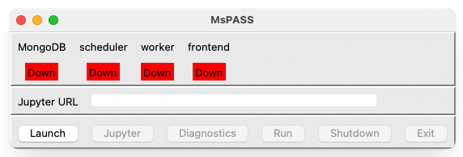
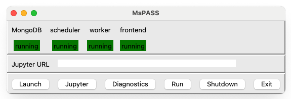
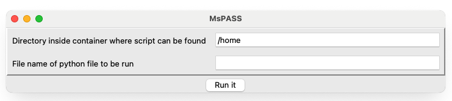

.. _mspass_desktop:

Run MsPASS with the Optional Desktop Launcher
==============================================

Start with the :ref:`desktop quick start <quick_start>`.  It is the shortest
path to a first MsPASS session and confirms that Docker, the MsPASS image, and
the project-directory mount work on your computer.

This page describes an optional graphical alternative.  The
`mspass_launcher project
<https://github.com/mspass-team/mspass_launcher>`__ is maintained separately
from MsPASS and installs the ``mspass-desktop`` command.  Its window starts
the same kinds of containerized services that the command-line guides manage.

.. important::

   Docker Desktop and ``mspass_launcher`` are different programs.  Docker
   Desktop provides the Docker engine and management interface on supported
   desktop systems.  ``mspass_launcher`` is a separate Python package whose
   GUI sends commands to Docker.  Installing either one does not install the
   other.  Linux users may use Docker Engine instead of Docker Desktop, but
   the launcher still requires the Docker Compose v2 command.

Prerequisites
-------------

Before installing the launcher:

* Complete the :ref:`desktop quick start <quick_start>`, or at least confirm
  that ``docker version`` can reach the Docker server and that ``docker
  compose version`` succeeds.
* Use a host Python installation with Tk support.  The launcher window runs
  on the host; Python inside the MsPASS container does not provide that
  window.  This command is a quick import check:

  .. code-block:: console

     python -c "import tkinter; print(tkinter.TkVersion)"

* Make enough CPU, memory, and disk space available for MongoDB, JupyterLab,
  a Dask scheduler, and Dask workers to run together.

The launcher is an external package, so consult its `project page
<https://github.com/mspass-team/mspass_launcher>`__ for current Python and
platform support rather than assuming that the requirements of a particular
release still apply.

Install the launcher in an isolated environment
-----------------------------------------------

Use a launcher-specific virtual environment so that its Python dependencies
do not modify the environment used for other projects.

On Linux or macOS, run:

.. code-block:: bash

   python -m venv "$HOME/.venvs/mspass-launcher"
   source "$HOME/.venvs/mspass-launcher/bin/activate"
   python -m pip install mspass_launcher
   mspass-desktop --help

On Windows PowerShell, run:

.. code-block:: powershell

   python -m venv "$HOME\.venvs\mspass-launcher"
   & "$HOME\.venvs\mspass-launcher\Scripts\Activate.ps1"
   python -m pip install mspass_launcher
   mspass-desktop --help

Activate this environment again before each launcher session.  The final
command verifies that the ``mspass-desktop`` entry point is available without
starting the cluster.

Choose the project directory
----------------------------

Create or select a dedicated host directory for the project, then change to
it *before* starting ``mspass-desktop``.  You can reuse the directory created
by the quick start.

The launcher's default Compose configuration bind-mounts the directory from
which it was started at ``/home`` in the containers.  Consequently, a
notebook, script, or result saved under ``/home`` is stored in the host
project directory and remains there after the containers stop.  Do not assume
that files written elsewhere inside a container are persistent.  Return to
the same host directory when continuing that project in a later session.

With the current MsPASS image defaults, the services also create these
launcher-managed directories under the host project directory:

``db/``
   Persistent MongoDB files, including the database under ``db/data/``.

``logs/``
   MongoDB, scheduler, and worker logs.

``work/``
   Dask worker scratch files.  Treat this as temporary operational storage,
   not as the only copy of an input or result.

Stop the launcher before copying ``db/`` for backup or moving the project
directory.  Do not delete files under ``db/`` while MongoDB is running.

Start the launcher
------------------

Start Docker, activate the launcher's virtual environment, and change to the
project directory.  Then run:

.. code-block:: console

   mspass-desktop

The initial window should resemble the following figure.  All four service
states are ``Down``, and only **Launch** is available.

.. _desktop_startup_window:

   Initial ``mspass-desktop`` window before the services are started.

Select **Launch** and allow the containers time to start.  The status row
reports the MongoDB, scheduler, worker, and frontend services independently.
Each one should eventually report ``running`` on a green background.

.. _desktop_operating_window:

   Launcher window after all four services report that they are running.

Do not begin a workflow if a required service remains ``Down`` or reports a
different state.  Review the terminal that started ``mspass-desktop`` before
using the troubleshooting suggestions below.

.. note::

   In ``mspass_launcher`` 0.1.1, a status background can remain green after
   its text changes away from ``running``.  Treat the status text as
   authoritative and confirm an unexpected state with ``docker ps``.

.. warning::

   The launcher's default Compose file publishes MongoDB, Dask, and Jupyter
   ports on all host network interfaces and uses a well-known Jupyter
   password.  Use it only on a trusted computer and network.  Before running
   on an untrusted network, customize a project-local copy of the Compose
   configuration as described below, or use a command-line workflow that
   binds ports explicitly to ``127.0.0.1``.

Open JupyterLab
---------------

Select **Jupyter** after all services are running.  The launcher attempts to
open JupyterLab in a browser and writes the connection address into the
**Jupyter URL** field.  Browser auto-launch is platform- and
configuration-dependent.  If no browser window opens, copy the complete URL
from that field and paste it into a browser on the same computer.

The URL may contain an access token.  Treat the complete URL as a credential:
do not post it in an issue, log excerpt, or shared message.  Save notebooks
and results under Jupyter's ``/home`` directory so they remain in the host
project directory.

Open the Dask dashboard
-----------------------

Select **Diagnostics** after the services report that they are running.  The
launcher attempts to open the Dask dashboard in a browser.  With the default
configuration, you can open ``http://localhost:8787/status`` manually if the
browser does not open.  The dashboard reports connected workers, running
tasks, and memory use; it is diagnostic information rather than a substitute
for saving application output.

Run an existing Python script
-----------------------------

Select **Run** to open the script window:

.. _desktop_run_window:

   Window opened by the **Run** control.

The first field is a directory *inside the container*.  Leave it as ``/home``
for a script stored at the top level of the host project directory.  Enter
only the script's file name, such as ``analysis.py``, in the second field and
select **Run it**.  For ``scripts/analysis.py`` in the project directory, use
``/home/scripts`` and ``analysis.py``.

The launcher runs the script with Python in the scheduler service and prints
its standard output and error output in the terminal from which
``mspass-desktop`` was started.  Keep that terminal open.

.. important::

   In ``mspass_launcher`` 0.1.1, the **Run** control targets the
   ``mspass-scheduler`` service, but the packaged Compose file does not give
   that service ``MSPASS_DB_ADDRESS`` or ``MSPASS_SCHEDULER_ADDRESS``.  A
   script that constructs ``Client()`` without arguments therefore tries the
   wrong database location and does not connect to the already-running Dask
   scheduler.  Initialize it with the service addresses explicitly:

   .. code-block:: python

      from mspasspy.client import Client

      client = Client(
          database_host="mspass-db",
          scheduler="dask",
          scheduler_host="mspass-scheduler",
      )

   A project-local ``DesktopCluster.yaml`` can instead add
   ``MSPASS_DB_ADDRESS: mspass-db`` and
   ``MSPASS_SCHEDULER_ADDRESS: mspass-scheduler`` to the scheduler service's
   environment.  The Jupyter frontend already receives both addresses.

Prefer the
:ref:`command-line Docker workflow <run_mspass_with_docker>` or the
:ref:`Docker Compose deployment <deploy_mspass_with_docker_compose>` for
repeatable automation, custom service settings, or long unattended runs.

Shut down cleanly
-----------------

Save notebooks and wait for scripts to finish before stopping the services.
The GUI provides two related controls:

* **Shutdown** stops the Compose services and returns the window to its
  initial state, ready for another **Launch**.  If you are finished, close
  that idle window with the normal window control.
* **Exit**, while the services are running, stops them and closes the launcher
  in one action.

Use one of these controls while the GUI is responsive.  Do not rely on
closing the terminal or window to clean up running containers.  After an
unexpected exit, inspect Docker with ``docker ps`` or Docker Desktop's
container view before starting another session.

Troubleshooting
---------------

``mspass-desktop`` is not found
~~~~~~~~~~~~~~~~~~~~~~~~~~~~~~~

Activate the same virtual environment used for installation, then check the
package with:

.. code-block:: console

   python -m pip show mspass_launcher
   mspass-desktop --help

If ``pip show`` cannot find the package, confirm that ``python`` identifies
the intended environment and repeat the installation with that Python's
``python -m pip`` command.

The GUI does not open
~~~~~~~~~~~~~~~~~~~~~

Rerun the Tk import check under `Prerequisites`_ above.  If it fails, install
Tk support for the host Python distribution or choose a Python installation
that includes it.  Run ``mspass-desktop`` from a graphical desktop session,
not a headless terminal.

On macOS, a partial or malformed window can also indicate a conflict between
the selected Python distribution and Tk.  Compare the symptoms with
`mspass_launcher issue 7
<https://github.com/mspass-team/mspass_launcher/issues/7>`__ before changing
the Python environment; the issue describes one historical failure mode, not
a workaround that applies to every current macOS installation.

Docker commands fail or services stay down
~~~~~~~~~~~~~~~~~~~~~~~~~~~~~~~~~~~~~~~~~~

Run these checks in the same terminal used to start the launcher:

.. code-block:: console

   docker version
   docker compose version
   docker ps

A missing Docker server section usually means Docker Desktop or Docker Engine
is not running.  A permission error means the current account cannot access
the Docker service.  Follow the installation's documented permission model;
do not work around it by running the graphical launcher as an administrator
or with ``sudo``.

Also inspect the launcher's terminal output for a port conflict or a service
startup error.  The default configuration uses host ports ``27017``, ``8786``,
``8787``, and ``8888``.  If another application needs one of those ports, use
the command-line or Compose guides linked below for an explicit configuration
rather than editing files inside the launcher's installed Python package.

JupyterLab does not open automatically
~~~~~~~~~~~~~~~~~~~~~~~~~~~~~~~~~~~~~~

Wait until the frontend reports ``running``, select **Jupyter**, and copy the
complete address from **Jupyter URL** into a browser.  If the field remains
empty or the address does not connect, review the launcher terminal without
sharing any token-bearing URL.

Launcher-specific behavior or configuration
~~~~~~~~~~~~~~~~~~~~~~~~~~~~~~~~~~~~~~~~~~~~

Do not edit YAML files under ``site-packages`` in place; an upgrade can
replace them.  The launcher searches the current directory and its
``data/yaml`` subdirectory before falling back to its packaged defaults.  To
customize it safely, copy both ``MsPASSDesktopGUI.yaml`` and
``DesktopCluster.yaml`` from the installed package into ``data/yaml`` under
the host project directory, edit those copies, and continue to start the
launcher from that project directory.

To locate the packaged defaults in the active launcher environment, run:

.. code-block:: console

   python -c "import mspass_launcher, pathlib; print(pathlib.Path(mspass_launcher.__file__).parent / 'data' / 'yaml')"

``MsPASSDesktopGUI.yaml`` controls the following launcher behavior:

* ``docker_compose_yaml_file`` selects the Compose file.  Keep it pointed at
  the project-local ``DesktopCluster.yaml`` unless you intentionally use a
  different file.
* ``web_browser`` names the browser command used for automatic Jupyter and
  dashboard launch; the current packaged default is ``firefox``.  Manual URLs
  still work if browser launch is unsupported.
* ``minimum_window_size_x`` and ``minimum_window_size_y`` set the minimum GUI
  layout dimensions in pixels; both currently default to ``1000``.
* ``engine_startup_delay_time`` controls the initial wait before service
  checks and currently defaults to five seconds.  Increase it if a slower
  machine checks the containers too early.
* ``status_monitor_time_interval`` controls how often the GUI refreshes
  service status and currently defaults to ten seconds.

``DesktopCluster.yaml`` controls the images, mounts, ports, and service
environment.  The GUI expects the service names ``mspass-db``,
``mspass-scheduler``, ``mspass-worker``, and ``mspass-frontend``; do not rename
them in a launcher configuration.  Before selecting **Launch**, validate
Compose edits with
``docker compose --file data/yaml/DesktopCluster.yaml config``.  After
upgrading ``mspass_launcher``, compare your copies with the new packaged
defaults before reusing them.

Check the current `mspass_launcher documentation
<https://github.com/mspass-team/mspass_launcher>`__ and search its `issue
tracker <https://github.com/mspass-team/mspass_launcher/issues>`__ for
platform-specific GUI, browser, shutdown, or configuration problems.  When
reporting a problem, remove Jupyter tokens and other project-sensitive data
from logs and screenshots.

Command-line alternatives
-------------------------

The graphical launcher is not required to use MsPASS:

* :ref:`MsPASS Desktop Quick Start <quick_start>` is the recommended first
  run.
* :ref:`Run MsPASS with Docker <run_mspass_with_docker>` documents the
  detailed single-container workflow and common failures.
* :ref:`Command Line Docker Desktop Operation
  <command_line_docker_desktop_operation>` gives a broader command-line
  overview.
* :ref:`Deploy MsPASS with Docker Compose
  <deploy_mspass_with_docker_compose>` covers explicit multi-container
  configuration and management.
