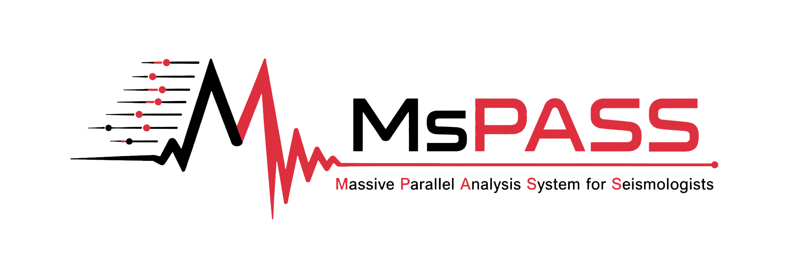
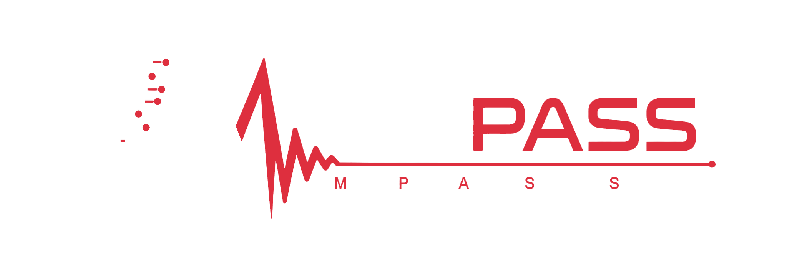

MsPASS Documentation
====================

MsPASS (Massive Parallel Analysis System for Seismologists) is an open-source
framework for seismic data processing and management.  It combines a
scalable, dataflow-oriented parallel processing model, a NoSQL document-store
data-management layer, and a container-based virtualization and deployment
environment.  MsPASS builds on the
`ObsPy <https://obspy.org/>`__ toolkit and C++ components derived from
`SEISPP <http://www.indiana.edu/~pavlab/software/seispp/html/index.html>`__.

Choose your path
----------------

First-time desktop users
   Follow the :doc:`desktop quick start <getting_started/quick_start>`, then
   choose the :doc:`single-container Docker guide
   <getting_started/run_mspass_with_docker>` or the
   :doc:`MsPASS Desktop graphical launcher <getting_started/mspass_desktop>`.

Data-processing users
   Begin with :doc:`seismic data objects
   <user_manual/data_object_design_concepts>`, continue to
   :doc:`database concepts <user_manual/database_concepts>`, and then browse
   the :doc:`processing algorithms <user_manual/algorithms>`.

Cluster deployers
   Read the :doc:`virtual-cluster concepts
   <getting_started/getting_started_overview>` before following the
   :doc:`HPC deployment guide <getting_started/deploy_mspass_on_HPC>` or a
   platform-specific deployment page.

API readers
   Go directly to the :doc:`Python API <python_api/index>`,
   :doc:`C++ API <cxx_api/index>`, or :doc:`MsPASS schema
   <mspass_schema/mspass_schema>`.

.. toctree::
   :maxdepth: 1
   :caption: Concepts and Architecture

   user_manual/introduction
   user_manual/components

.. toctree::
   :maxdepth: 1
   :caption: Start on a Desktop

   Fast path: desktop quick start <getting_started/quick_start>
   Single-container Docker guide <getting_started/run_mspass_with_docker>
   Graphical launcher: MsPASS Desktop <getting_started/mspass_desktop>
   Advanced Docker CLI and Compose overview <getting_started/command_line_desktop>
   Multi-container Docker Compose deployment <getting_started/deploy_mspass_with_docker_compose>
   Conda installation <getting_started/deploy_mspass_with_conda>
   Advanced setup considerations <getting_started/advanced_setup_considerations>

.. toctree::
   :maxdepth: 1
   :caption: Clusters and Hosted Environments

   Virtual-cluster concepts <getting_started/getting_started_overview>
   HPC deployment <getting_started/deploy_mspass_on_HPC>
   HPC launcher configuration <getting_started/HPCClusterLauncher_configuration>
   Conda and Coiled deployment <getting_started/deploy_mspass_with_conda_and_coiled>
   EarthScope GeoLab <getting_started/deploy_mspass_on_geolab>

.. toctree::
   :maxdepth: 1
   :caption: Seismic Data Foundations

   user_manual/data_object_design_concepts
   user_manual/numpy_scipy_interface
   user_manual/obspy_interface
   user_manual/time_standard_constraints
   user_manual/processing_history_concepts
   user_manual/continuous_data

.. toctree::
   :maxdepth: 1
   :caption: Database and Data Ingestion

   user_manual/database_concepts
   user_manual/schema_choices
   user_manual/mongodb_and_mspass
   user_manual/CRUD_operations
   user_manual/normalization
   user_manual/importing_data
   user_manual/importing_tabular_data

.. toctree::
   :maxdepth: 1
   :caption: Processing Workflows

   user_manual/algorithms
   user_manual/handling_errors
   user_manual/data_editing
   user_manual/cleaning_metadata
   user_manual/header_math
   user_manual/signal_to_noise
   user_manual/arrival_time_measurement
   user_manual/deconvolution
   user_manual/graphics
   user_manual/adapting_algorithms

.. toctree::
   :maxdepth: 1
   :caption: Scaling and Performance

   user_manual/parallel_processing
   user_manual/memory_management
   user_manual/io
   user_manual/parallel_io

.. toctree::
   :maxdepth: 1
   :caption: Help and Workflow Development

   user_manual/FAQ
   user_manual/development_strategies

.. toctree::
   :maxdepth: 2
   :caption: API and Schema Reference

   Python API <python_api/index>
   C++ API <cxx_api/index>
   MsPASS schema <mspass_schema/mspass_schema>
