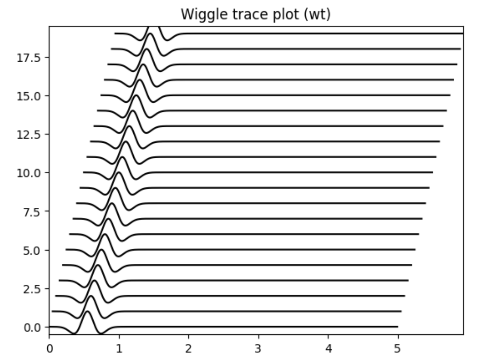
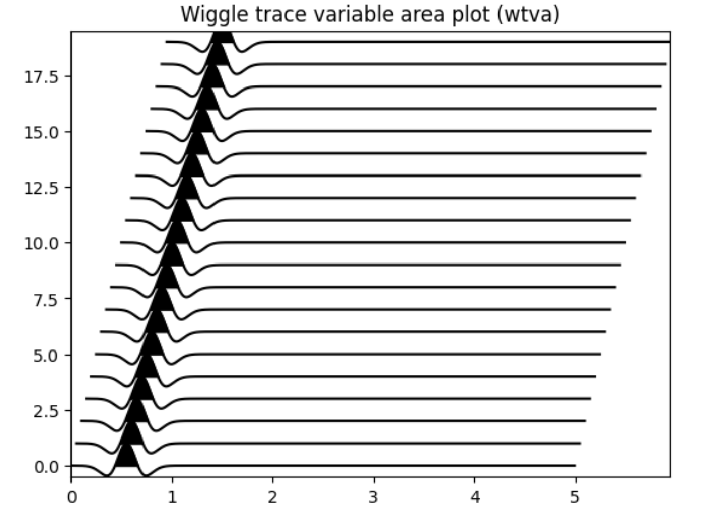
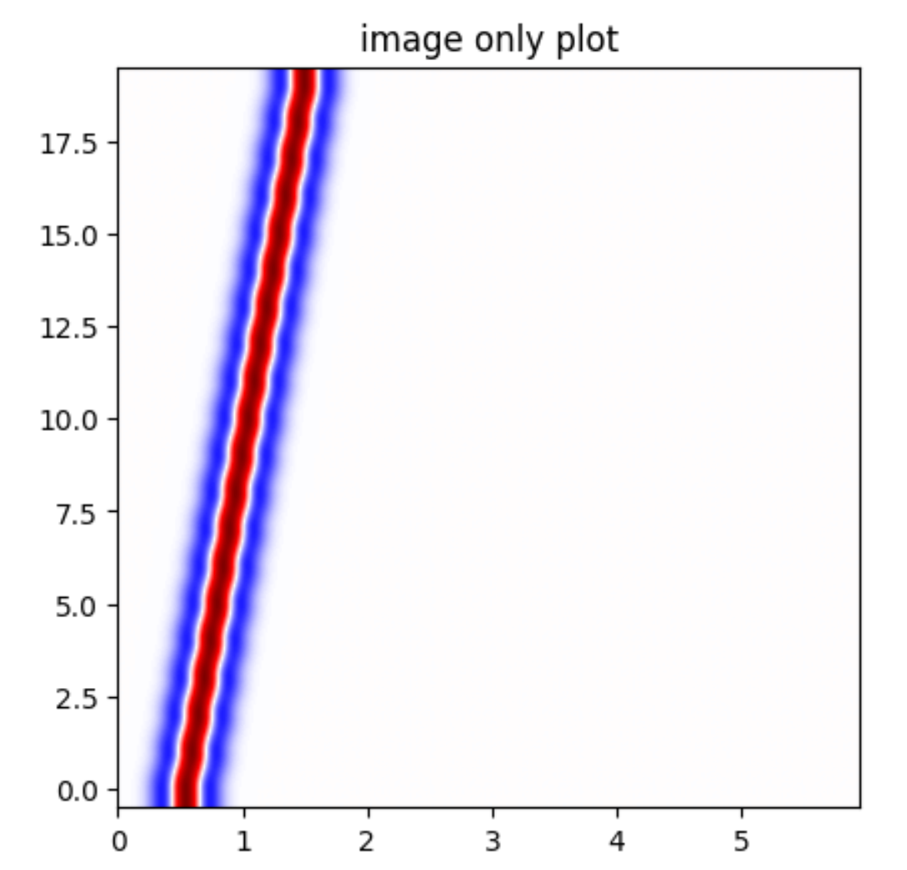
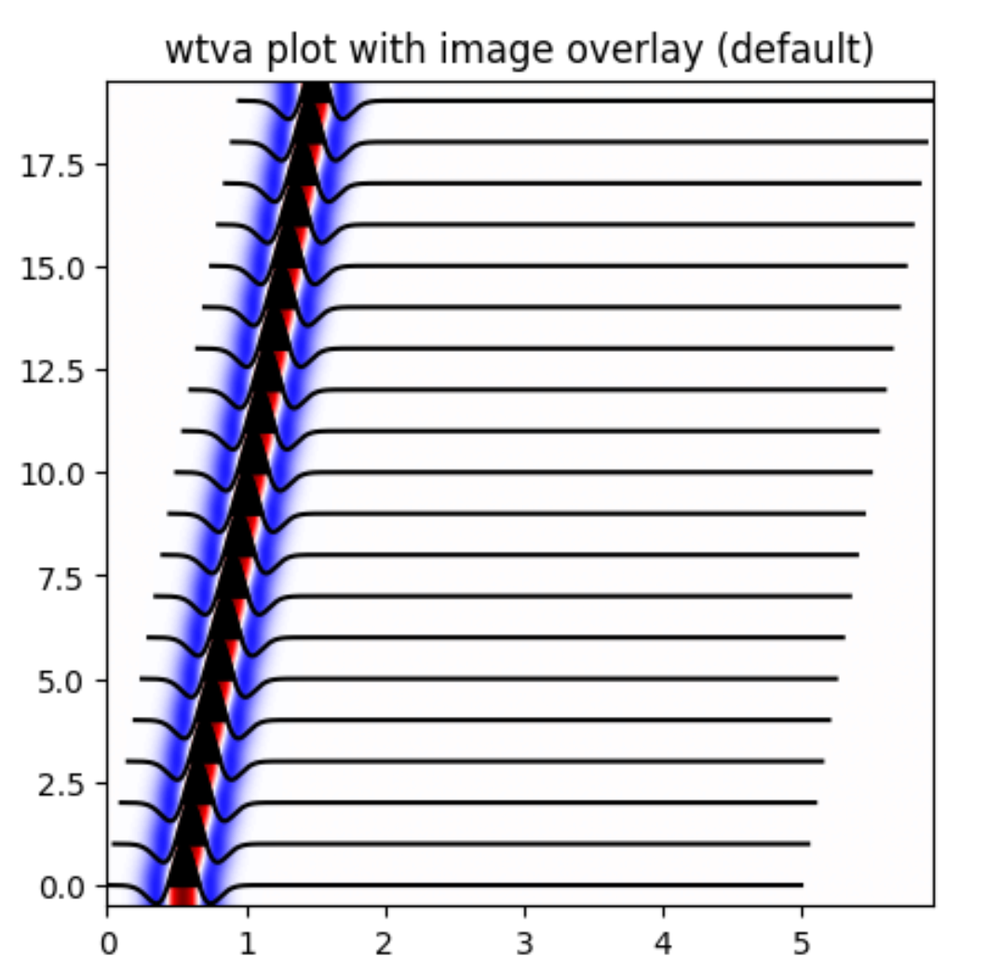

.. _Graphics:

Graphics in MsPASS
==============================

Overview
~~~~~~~~~~~

Data visualization in general and graphics to visualize seismic data
in particular are critical elements to understand data and the
result of a processing workflow.   On the other hand, because of the
importance of graphical presentation there are a huge number of packages
available today to create various types of graphics.   The main goal of
MsPASS is a framework to support parallel processing to make previously
unfeasible data sets and/or algorithms feasible.  Consequently, in our
initial development we aimed to provide only basic support for graphics
of native data types.  Users should understand that custom graphics beyond our
basic support support is the user's responsibility.  Because of the
large number of options in existence we believe that is reasonable compromise
with finite resources.

The current support for graphics has two component.

1.  We have plotting classes called :code:`SeismicPlotter`
    and :code:`Sectionplotter` to plot our native data types.
2.  As noted elsewhere a core component of MsPASS are fast conversions routines
    to and from obspy's native data types (:code:`Trace` and :code:`Stream`).
    That is relevant because obspy's native data types have integrated
    plot methods that produce wiggle trace plots of seismic data using the
    matplotlib library.

The best way to understand the concepts and features of the graphics
module is to run our graphics tutorial found
`here <https://github.com/mspass-team/mspass_tutorial/blob/master/notebooks/BasicGraphics.ipynb>`__.

Native Graphics
~~~~~~~~~~~~~~~~~~~~~~
Since our goal was simple methods to plot native data types, we first remind
the user what is considered native data in MsPASS.  They are:
(1) :code:`TimeSeries` objects are scalar, uniformly sampled seismic
seismic signals (a single channel), (2) :code:`Seismogram` objects are
bundled three-component seismic data, and (3) :code:`TimeSeriesEnsemble` and
:code:`SeismogramEnsemble` objects are logical groupings of the two
"atomic" objects in their names.

The second issue is what types of plots are most essential?   Our core
graphics support two plot conventions:

1.  :code:`SeismicPlotter` plots data in the standard convention used to plot
    nearly all earthquake data.  :code:`SeismicPlotter` plots data with
    time as the x (horizontal axis).
2.  :code:`SectionPlotter` plots data in the standard convention for seismic
    reflection data.  Because with seismic reflection data normal moveout
    corrected time is a proxy for depth it is universal to plot time
    as the y axis (vertical) and running backward from the normal
    mathematical graphic convention.   i.e. time is always plotted with
    0 at the top of the plot and the longest travel time at the bottom of
    the plot.

There are also a number of common ways to plot seismic data.   Our graphics
classes support the four most common methods:

1.  Many seismologists prefer the simple :code:`wiggle trace (wt)` plot for
    displaying earthquake signals.  As the name implies the plot is a line
    graphic of the signal.
2.  The traditional standard plot method for reflection data is usually called a
    :code:`wiggle trace variable area (wtva)` plot.  As the name implies such plots are
    first a wiggle trace plot, but the plot adds a "variable area".  The
    "variable area" term means you fill positive values with a color.
    Traditional plots from past when paper records were the norm is black but
    other colors are common in published papers today.  Our plotting
    classes allow changing the fill to any color.
3.  :code:`image plot (img)` graphics have been the norm in plotting reflection data since
    at least the 1990s.  An image plot uses a color map scaled by amplitude.
    These plots are most appropriate for data that are like modern reflection data:
    the data density is high and there is a strong correlation between
    signals plotted side-by-side.
4.  The most complicated plot is what we call a
    :code:`wiggle trace variable area with image overlay (wtvaimg)` plot.
    The best way to understand this plot, and in fact is exactly how it is
    produced, is to first plot the data as an image plot and then overlay a
    wiggle trace variable area plot.

Below are examples of all four types of plots from our
`graphics tutorial <https://github.com/mspass-team/mspass_tutorial/blob/master/notebooks/BasicGraphics.ipynb>`__.

.. _wiggle_trace_example_figure:

    Wiggle trace example from graphics tutorial.  This type of plot is
    produced by the :py:class:`SeismicPlotter<mspasspy.graphics.SeismicPlotter>`
    python class with the "style" set as "wt".

.. _wiggle_trace_variable_area_example_figure:

    Wiggle trace, variable area example from graphics tutorial.  This type of plot is
    produced by the :py:class:`SeismicPlotter<mspasspy.graphics.SeismicPlotter>`
    python class with the "style" set as "wtva".

.. _image_plot_example_figure:

    Image plot example from graphics tutorial.  This type of plot is
    produced by the :py:class:`SeismicPlotter<mspasspy.graphics.SeismicPlotter>`
    python class with the "style" set as "img".

.. _wtvaimg_example_figure:

    Wiggle trace, variable area plot with image overlay example
    from graphics tutorial.  This type of plot is
    produced by the :py:class:`SeismicPlotter<mspasspy.graphics.SeismicPlotter>`
    python class with the "style" set as "wtvaimg".

Finally, we would note that the plotters automatically handle switching to
plot all the standard MsPASS data objects.   Some implementation details
we note are:

1.  :code:`TimeSeries`  data generate one plot frame with a time axis and
    a y axis of amplitude.
2.  :code:`Seismogram` data are displayed on one plot frame.  The three
    components are plotted at equal y intervals in SeismicPlotter
    (equal x intervals in SectionPlotter) with the x1, x2, x3 components arranged
    from the bottom up (left to right for SectionPlotter).   There is an option
    for both types of plots to reverse the order.
3.  :code:`TimeSeriesEnsmble` data in a SeismicPlotter plot are plotted
    at equal intervals from the bottom up (i.e. member[0] is at the bottom)
    of the plot and the last member is a the top.   Similarly, the
    SectionPlotter plots members at equal intervals ordered from left to right.
    As with the Seismogram plot the order can be flipped.  We currently have
    no support for variable spacing of plots used, for example, to plot
    record sections.   We recommend using other packages for that purpose.
4.  :code:`SeismogramEnsembles` have the most variance in how they could be
    plotted.  We chose to always plot such data in three different windows.
    The graphic for each component is actually done using a same method
    as that for plotting a TimeSeriesEnsemble.  i.e. the plots generated to
    plot a SeismogramEnsemble are three instances of plots for TimeSeriesEnsemble
    data - one for each component.

A final point is that any plotting of earthquake data nearly always
requires some form of scaling to prevent some data from clipping while others
will look like flat lines even if they contain valid data.  The technical reason
is that the dynamic range of any graphics devices is tiny compared to that
of modern digital data acquisition systems (about 8 bits for graphics compared
to 24 bit acquisition that is now the norm for earthquake data).  There is
an internal scaling parameter that can be used for all graphics, but the
internal scaling is inflexible.  If the default scaling proves inadequate
use one of the functions for data scaling in :py:mod:`mspasspy.ccore.algorithms.amplitudes`.

Obspy Graphics
~~~~~~~~~~~~~~~~~~~~~~

User's familiar with obspy may, in come cases, prefer to utilize obspy's
built in graphics.   Obspy's data objects
(:py:class:`Trace <obspy.core.trace.Trace>`
and
:py:class:`Stream <obspy.core.stream.Stream>`)
have a plot method as a member of the data object.  MsPASS has
a suite of fast converters between obspy and MsPASS data objects.
These converters can be used in plotting scrips like the following:

.. code-block:: python

   # Something above created d as a TimeSeriesEnsemble
   d_obspy=TimeSeriesEnsemble2Stream(d)
   d_obspy.plot()

Extending MsPASS Graphics
~~~~~~~~~~~~~~~~~~~~~~~~~~~
As noted at the beginning of this section the graphics available in
MsPASS are simple by design.   If you need different graphics capabilities
you have several different choices:

#.  Develop a custom plotting feature with matplotlib or some other
    python package.  Any external python
    package that can supports plotting of numpy arrays can produce plots with
    MsPASS data objects by referencing the data arrays directly.  e.g. if
    `d` refers to a `TimeSeries` object the symbol `d.data` can be passed to
    any numpy function that expects a numpy implementation of a vector.
    For example, the following code fragment could be used to plot log
    amplitudes as a function of time:

    .. code-block:: python

      import maplotlib.pyplot as plt
      import numpy as np
      # code to define d
      damp = np.log10(d.data)
      # This is a coversion to time relative to data start time
      t = np.zeros(d.npts)
      for i in range(d.npts):
        t[i] = d.time(i)-t0
      plt.plot(t,damp)

#.  Export a subset of your data you want to plot with an external
    package that is not a python package.  A type example is Seismic Unix
    where the data would need to be exported with SEGY with obspy's segy
    writer and then passed through a custom Seismic Unix shell script.
#.  Extend the SectionPlotter or SeismicPlotter classes using python's inheritance
    mechanism.  If you look under the hook you will find that both classes use the
    same python graphics library as obspy:
    `matplotlib <https://matplotlib.org/stable/index.html>`__.
    Although the top level :code:`plot` method returns nothing, the internal
    methods that function uses all return a matplotlib handle.  Many
    extensions of our graphics could be implemented by using those
    plot handles and using additional matplotlib functions to decorate the
    graphic or create GUI extensions.
