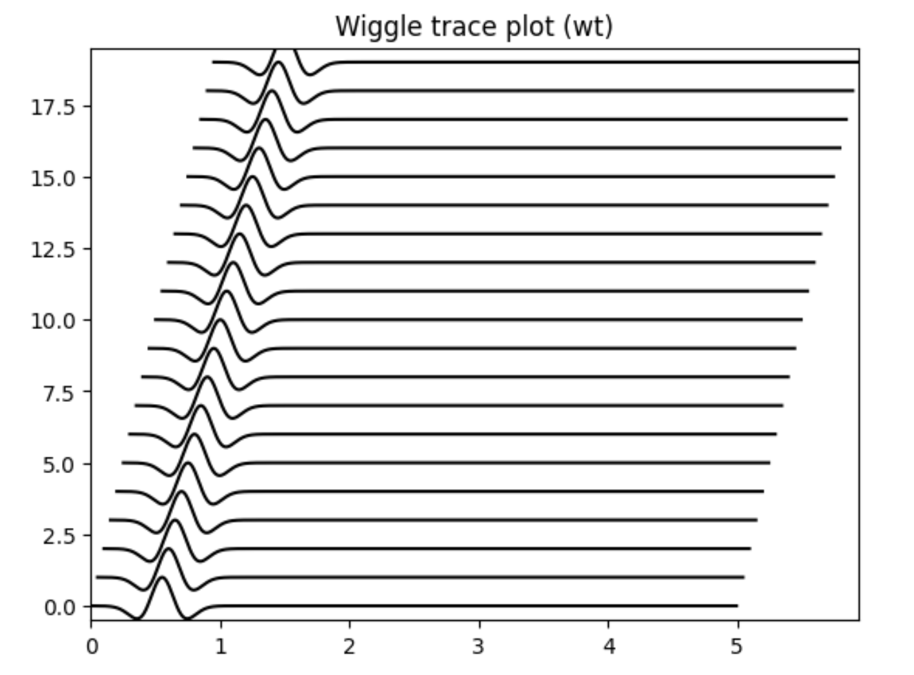
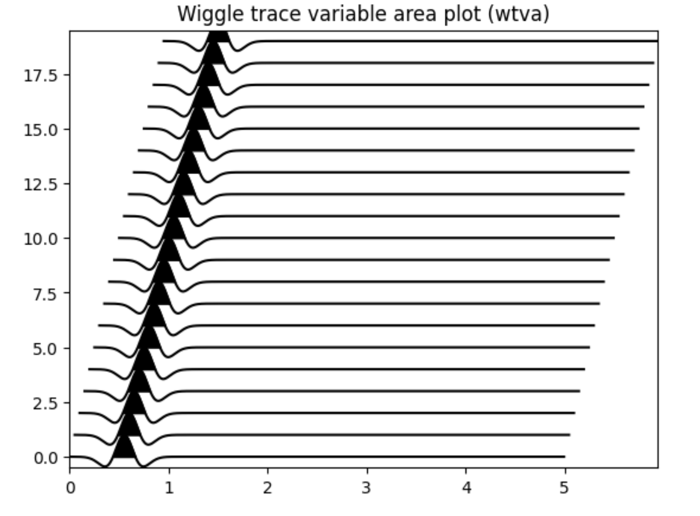
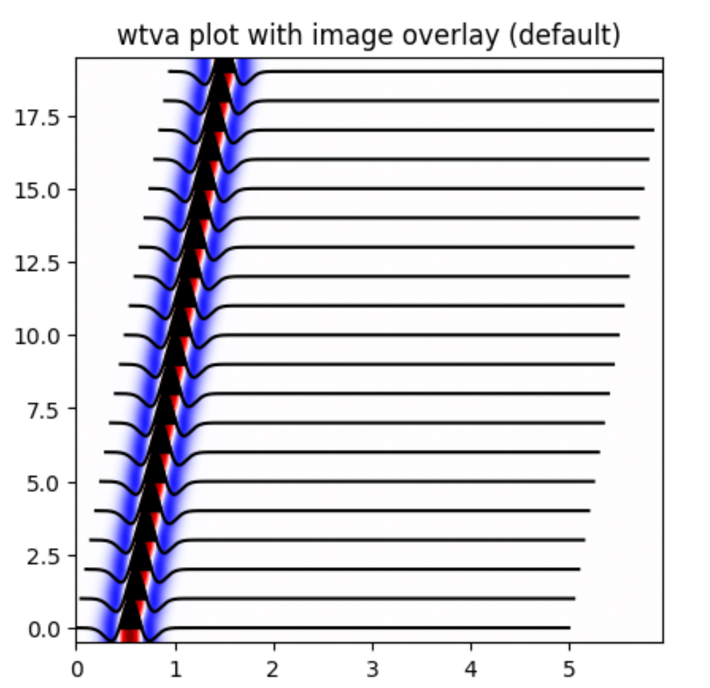
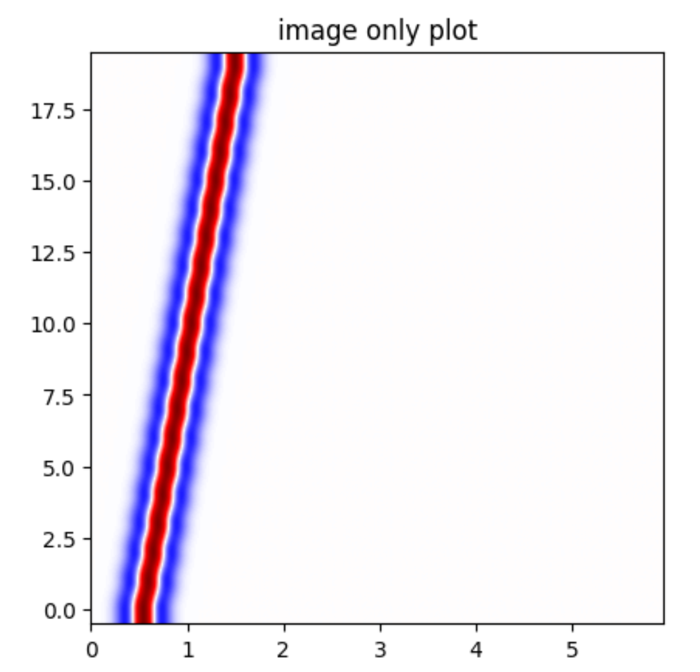

.. _Graphics:

Graphics in MsPASS
==============================

Overview
~~~~~~~~~~~

Data visualization in general, and graphics for seismic data in particular,
are critical for understanding data and the results of a processing workflow.
Because graphical presentation is important, however, there are many packages
available today to create various types of graphics.   The main goal of
MsPASS is to support parallel processing that makes previously
unfeasible data sets and/or algorithms feasible.  Consequently, in our
initial development we aimed to provide only basic support for graphics
of native data types.  Users should understand that custom graphics beyond our
basic support is the user's responsibility.  Because of the
large number of available options, we believe that is a reasonable compromise
with finite resources.

The current support for graphics has three components.

#.  The lowest level support is to use the commonly used package
    called `matplotlib <https://matplotlib.org/>`__.   Because the
    sample arrays of all seismic objects act like NumPy arrays, that
    is often the simplest mechanism to make a quick plot.  The basics of
    that approach are described below.
#.  We provide plotting classes called
    :py:class:`SeismicPlotter <mspasspy.graphics.SeismicPlotter>` and
    :py:class:`SectionPlotter <mspasspy.graphics.SectionPlotter>` for native
    MsPASS data types.
#.  As noted elsewhere, MsPASS provides fast conversion routines to and from
    ObsPy's native :py:class:`Trace <obspy.core.trace.Trace>` and
    :py:class:`Stream <obspy.core.stream.Stream>` types.  Those classes have
    integrated plotting methods, providing an alternative to custom Matplotlib
    plots made from primitives.

Matplotlib graphics
~~~~~~~~~~~~~~~~~~~~
Because the data vectors of
:py:class:`TimeSeries<mspasspy.ccore.seismic.TimeSeries>` and
:py:class:`Seismogram<mspasspy.ccore.seismic.Seismogram>` objects
act like NumPy arrays, the symbol defining the data vector
can be passed directly to Matplotlib's low-level plotters.
Here, for example, is a code fragment that would plot the
data in a :py:class:`TimeSeries<mspasspy.ccore.seismic.TimeSeries>` object
with a simple wiggle plot and a time axis with 0 defined as start time.

.. code-block:: python

  import matplotlib.pyplot as plt
  import numpy as np

  # Other code defines d as a TimeSeries.
  t = np.asarray(d.time_axis()) - d.t0
  plt.plot(t, np.asarray(d.data))
  plt.xlabel("Time since first sample (s)")
  plt.show()

Similarly, one way to plot a :py:class:`mspasspy.ccore.seismic.Seismogram`
object is the following with subplots:

.. code-block:: python

  import matplotlib.pyplot as plt
  import numpy as np

  # Other code defines d as a Seismogram.
  t = np.asarray(d.time_axis()) - d.t0
  data = np.asarray(d.data)
  fig, axes = plt.subplots(3, sharex=True)
  for component in range(3):
    axes[component].plot(t, data[component, :])
  axes[-1].set_xlabel("Time since first sample (s)")
  plt.show()

A few comments about these examples:

#.  Both use the ``time_axis`` method shared by
    :py:class:`TimeSeries <mspasspy.ccore.seismic.TimeSeries>` and
    :py:class:`Seismogram <mspasspy.ccore.seismic.Seismogram>`.  Subtracting
    ``d.t0`` makes the first plotted sample zero without changing ``d``.
    For long UTC records, use Matplotlib's date support or the ObsPy plotting
    approach described below.
#.  Matplotlib has many options that can enhance these plots, such as axis
    labels, titles, UTC date strings
    for the time axis for long records, different symbol styles, etc.
    The point is that for custom plots Matplotlib provides all the tools
    you are likely to need.  In fact, the MsPASS graphics module
    itself uses Matplotlib.

Native Graphics
~~~~~~~~~~~~~~~~~~~~~~
The goal of the graphics module in MsPASS is to
provide simple tools to plot native data types.  First recall what is considered
"native data" in MsPASS: (1)
:py:class:`TimeSeries <mspasspy.ccore.seismic.TimeSeries>` objects are scalar,
uniformly sampled seismic signals (a single channel), (2)
:py:class:`Seismogram <mspasspy.ccore.seismic.Seismogram>` objects are bundled
three-component seismic data, and (3)
:py:class:`TimeSeriesEnsemble <mspasspy.ccore.seismic.TimeSeriesEnsemble>` and
:py:class:`SeismogramEnsemble <mspasspy.ccore.seismic.SeismogramEnsemble>`
objects are logical groupings of the two
"atomic" objects in their names.

The next question is which plot conventions are most useful.  The
graphics module supports two plot conventions:

1.  :py:class:`SeismicPlotter <mspasspy.graphics.SeismicPlotter>` uses the
    standard convention for most earthquake data, with time on the horizontal
    axis.
2.  :py:class:`SectionPlotter <mspasspy.graphics.SectionPlotter>` uses the
    standard convention for seismic
    reflection data.  Because with seismic reflection data normal moveout
    corrected time is a proxy for depth, it is customary to plot time
    as the y axis (vertical) and running backward from the normal
    mathematical graphics convention.  Time increases downward; with the
    usual relative-time input, zero is at the top and the longest travel time
    is at the bottom.

There are also a number of common ways to plot seismic data.   Our graphics
classes support the four most common methods:

1.  Many seismologists prefer the simple ``wiggle trace (wt)`` plot for
    displaying earthquake signals.  As the name implies the plot is a line
    graphic of the signal.
2.  The traditional standard plot method for reflection data is usually called a
    ``wiggle trace variable area (wtva)`` plot.  As the name implies such plots are
    first a wiggle trace plot, but the plot adds a "variable area".  The
    "variable area" term means you fill positive values with a color.
    Traditional paper plots used black fill, but
    other colors are common in published papers today.  Our plotting
    classes allow changing the fill to any color.
3.  ``image plot (img)`` graphics have been the norm in plotting reflection data since
    at least the 1990s.  An image plot uses a color map scaled by amplitude.
    These plots are most appropriate for data that are like modern reflection data:
    the data density is high and there is a strong correlation between
    signals plotted side-by-side.
4.  The most complicated plot is what we call a
    ``wiggle trace variable area with image overlay (wtvaimg)`` plot.
    This is produced by first plotting the data as an image and then overlaying a
    wiggle trace variable area plot.  It is most appropriate for data that
    have similar waveforms but have a density low enough to resolve the
    individual wiggle traces.

Below are examples of all four plot types from the graphics tutorial in the
`MsPASS tutorial repository <https://github.com/mspass-team/mspass_tutorial>`__.
For API details, also review the Sphinx documentation for the
:py:mod:`mspasspy.graphics` module.

.. _wt_figure:

    Figure 1. Example of wiggle trace plot created by
    :py:class:`mspasspy.graphics.SeismicPlotter`.  This type of plot
    is created with the "style" set to "wt".
    (Set with :py:meth:`mspasspy.graphics.SeismicPlotter.change_style` method)

.. _wtva_figure:

    Figure 2.  Example of a wiggle trace variable area plot created by
    :py:class:`mspasspy.graphics.SeismicPlotter`.  The data plotted
    are the same as Figure 1.  This type of plot
    is created with the "style" set to "wtva".
    (Set with :py:meth:`mspasspy.graphics.SeismicPlotter.change_style` method)

.. _wtvaimg_figure:

    Figure 3.  Example of a wiggle trace variable area plot with an image
    background, created by
    :py:class:`mspasspy.graphics.SeismicPlotter`.  The data plotted
    are the same as Figure 1.  This type of plot
    is created with the "style" set to "wtvaimg".
    (Set with :py:meth:`mspasspy.graphics.SeismicPlotter.change_style` method)

.. _img_figure:

    Figure 4.  Example of image plot created by
    :py:class:`mspasspy.graphics.SeismicPlotter`.  The data plotted
    are the same as Figure 1.  This type of plot
    is created with the "style" set to "img".
    (Set with :py:meth:`mspasspy.graphics.SeismicPlotter.change_style` method)

The two plotters share most conventions, but their current handling of native
types differs in a few important ways:

1.  :py:class:`SeismicPlotter <mspasspy.graphics.SeismicPlotter>` displays a
    :py:class:`TimeSeries <mspasspy.ccore.seismic.TimeSeries>` in one figure
    with time on the x axis and amplitude on the y axis.
2.  A :py:class:`Seismogram <mspasspy.ccore.seismic.Seismogram>` is displayed
    by ``SeismicPlotter`` in one figure, with components 0, 1, and 2 at equal
    vertical intervals from bottom to top.
3.  :py:class:`TimeSeriesEnsemble <mspasspy.ccore.seismic.TimeSeriesEnsemble>`
    members are equally spaced.  ``SeismicPlotter`` defaults to member 0 at
    the bottom and can reverse the order with its ``topdown`` method.
    :py:class:`SectionPlotter <mspasspy.graphics.SectionPlotter>` places the
    members from left to right and currently has no public order-reversal or
    variable-spacing option.  Use a custom Matplotlib plot when physical
    offsets rather than equal trace spacing are required.
4.  :py:class:`SeismogramEnsemble <mspasspy.ccore.seismic.SeismogramEnsemble>`
    data are displayed as three figures, one per component.  Each component
    figure is produced using the corresponding ``TimeSeriesEnsemble`` path.

.. warning::

   Use ``SeismicPlotter`` for atomic ``TimeSeries`` and ``Seismogram`` data.
   The current ``SectionPlotter`` atomic ``TimeSeries`` path raises an error,
   and its atomic ``Seismogram`` conversion does not orient the sample matrix
   as three traces.  Its ensemble paths support all four plot styles described
   above.

A final point is that plotting earthquake data nearly always requires some
form of scaling to prevent strong signals from clipping while weaker but valid
signals look flat.  Both plotters expose ``scale`` and ``normalize`` settings;
when ``normalize=True``, ``SeismicPlotter`` scales a copy rather than modifying
the input.  For explicit workflow-controlled scaling, use
:py:func:`scale <mspasspy.algorithms.window.scale>` before plotting.  It supports
atomic and ensemble inputs, several amplitude metrics, and section-wide or
per-member scaling.

ObsPy Graphics
~~~~~~~~~~~~~~~~~~~~~~

Users familiar with ObsPy may prefer to use its built-in graphics.  ObsPy's
data objects
(:py:class:`Trace <obspy.core.trace.Trace>`
and
:py:class:`Stream <obspy.core.stream.Stream>`)
have a ``plot`` method.  MsPASS has a suite of converters between ObsPy and
MsPASS data objects.  These converters can be used in plotting scripts like
the following:

.. code-block:: python

   from mspasspy.util.converter import TimeSeriesEnsemble2Stream

   # Something above created d as a TimeSeriesEnsemble.
   d_obspy = TimeSeriesEnsemble2Stream(d)
   d_obspy.plot()

:py:func:`TimeSeriesEnsemble2Stream <mspasspy.util.converter.TimeSeriesEnsemble2Stream>`
is also installed as the ``TimeSeriesEnsemble.toStream`` method
when :py:mod:`mspasspy.util.converter` is imported.  The explicit function in
the example makes the required import and conversion step clear.

Extending MsPASS Graphics
~~~~~~~~~~~~~~~~~~~~~~~~~~~
As noted at the beginning of this section, the graphics available in
MsPASS are simple by design.  If you need different capabilities, there are
three main options:

#.  Use Matplotlib's features to create a custom plot.
#.  Extend :py:class:`SectionPlotter <mspasspy.graphics.SectionPlotter>` or
    :py:class:`SeismicPlotter <mspasspy.graphics.SeismicPlotter>` using Python's
    inheritance
    mechanism.  If you look under the hood you will find that both classes use
    `Matplotlib <https://matplotlib.org/stable/index.html>`__ as noted earlier.
    ``SeismicPlotter.plot`` returns ``None``.  Most paths store figure handles
    accessible through :py:meth:`~mspasspy.graphics.SeismicPlotter.get_plot_gcf` and
    :py:meth:`~mspasspy.graphics.SeismicPlotter.get_3Censemble_gcf`.
    For atomic ``TimeSeries`` wiggle plots, use Matplotlib's ``plt.gcf()``;
    that path does not currently populate ``get_plot_gcf``.
    ``SectionPlotter.plot`` returns a list containing one figure handle, or
    three for a ``SeismogramEnsemble``.  These handles can be passed to
    additional Matplotlib functions to decorate a graphic or build GUI
    extensions.
#.  Export the subset of your dataset you want to plot and use a different
    graphics package to make the graphic you need.
