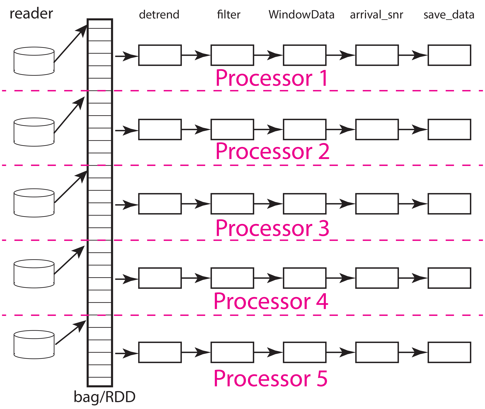
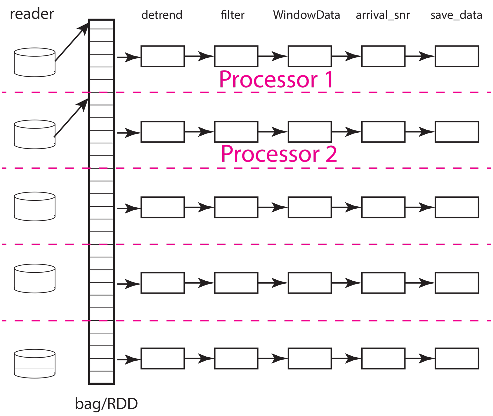
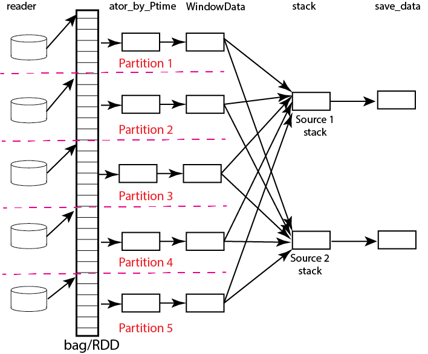

.. _memory_management:

Memory Management
======================
*Gary L. Pavlis and Ian (Yinzhi) Wang*

Overview
~~~~~~~~~~~

Dask and Spark, which are used in MsPASS to exploit parallel processing,
are generic packages to implement the map-reduce paradigm of parallel processing.
As generic frameworks Dask and Spark are flexible but not as efficient and
bombproof as a typical seismic reflection processing package.   One of the
biggest weaknesses we have found with these packages is default memory management
can lead to poor performance or, in the worst case, memory faults.
The biggest problem seems to be when the size of
the data objects considered atomic (Components of the generalized list called
an RDD by Spark and a bag by Dask) are a significant fraction of any nodes
memory.

In this document we discuss pitfalls we are aware of in
memory management with MsPASS.  This document is focused mainly on dask
because we have more experience using it.
The main dask document on dask memory management is found
`here <https://distributed.dask.org/en/stable/memory.html>`__.
The comparable page for spark is `here <https://spark.apache.org/docs/latest/tuning.html>`__.
As for most heavily used packages like this there are also numerous pages
on the topic that will quickly bury you with a web search.   We produced this
document to help you wade through the confusion by focusing on the practical
experience with MsPASS.  When we are talking specifically about dask or
spark we will say so.  We will use the term `scheduler` to refer to generic
concepts common to both.

*WARNING:*  This is an evolving topic the authors of MsPASS are continuing
to evaluate.   Treat any conclusions in this document with skepticism.

DAGs, tasks, and the map-reduce model of processing
~~~~~~~~~~~~~~~~~~~~~~~~~~~~~~~~~~~~~~~~~~~~~~~~~~~~
To understand the challenge a scheduler faces in processing a workflow,
and memory management we need to digress a bit and review the way a scheduler
operates.
Dask and spark both abstract processing as a sequence of "tasks".
A "task" in this context is more-or-less the operation defined in
a particular call to a "map" or "reduce" operator.
(If you are unfamiliar with this concept see section :ref:`parallel_processing`
and/or a web search for a tutorial on the topic.)  Each "task"
can be visualized as a black box that takes one or more inputs and
emits an output.  Since in a programming language that is the same
thing conceptually as a "function call" map and reduce operators always
have a function object as one of the arguments.   A "map" operator
has one main input (arguments to the function
are auxiliary data) and a single output (the function return).
Reduce operators have many inputs of a common
data type and one output.   Note, however, the restriction that
they are always considered two at a time. For most MsPASS operators the inputs and
outputs are seismic data objects.  The only common exception is constructs
used to provide inputs to readers such as when `read_distributed_data`
is used to load ensembles.

Dask and spark both abstract the job they are asked to handle
as a tree structure called a "Directed Acyclic Graph" (DAG).
The nodes of the tree are individual "tasks".  It has been our experience
that most workflows end up being only a sequence of map operators.
In that case, the DAG reduces to a forest of saplings (sticks with no
branches) with the first task being a read operation and the last being
a write (save) operation.

To clarify that abstract idea consider a concrete example.   The
code box below is a dask implementation of a simple job with
7 steps:   query database to define the dataset, read data,
detrend, bandpass filter, window around P arrival time,
compute signa-to-noise estimates, and
save result.   Here is a sketch of the workflow omitting complexities of
imports and initializations:

.. code-block:: python

   # assume database handle, db, and query are defined earlier
   cursor = db.wf_miniseed.find(query)
   # Npartitions assumed defined in initializations - see text below for
   # what this defines and why it is important for memory management
   mybag = read_distributed_data(db,cursor,npartitions=Npartitions)
   mybag = mybag.map(detrend)
   mybag = mybag.map(filter,type="bandpass",freqmin=0.01,freqmax=1.5)
   mybag = mybag.map(WindowData,-200.0,200.0)
   # assume nwin and swin defined initialization
   mybag = mybag.map(arrival_snr,noise_window=nwin,signal_window=swin)
   mybag = mybag.map(db.save_data,data_tag="step1",return_data=False)
   mybag.compute()

This simple workflow consists only of map operators and is terminated by
a save followed by a compute to initiate the (lazy) computation of the bag.
The DAG for this workflow is illustrated below

.. _DAG_figure:

    Block diagram illustration of DAG defined by example workflow.
    The example shows how work would be partitions with five processors
    and five partitions.   The labels at the top are function names
    matching those used in the python code above.   Each box denotes an
    instance of that function run on one processor (worker).   Data flow
    is from left to right.  Data enter each pipeline from a reader on the
    left hand side (`read_distributed_data` but here given the simpler name
    "reader") and exit in the save operation.   For this simple case where the
    number of processors match the number of partitions each processor would
    be assigned 1/5th of the data.  Termination of the workflow with a database
    save (`save_data`) makes each pipeline largely independent of the others and
    can improve performance as not processor has to wait for another except in
    competition for attention from the database server.

Now remember that a bag (RDD in spark) can be conceptualized as a
container that is a list of data objects that doesn't necessarily fit
into cluster memory, let alone
a single node.   Both dask and spark divide the container into
`partitions` illustrated in the figure above.   The partition size can be
as small as one data object or some larger integer less than or equal to the
number of data components.   Think of a partition as the size of a bite
the system uses to eat the elephant (the whole data set).   That basic
understanding should help you immediately realize that the partition
size relative to system memory is a critical tuning component to optimize
performance and make a workflow feasible.   Setting the number of partitions
too large can overwhelm the scheduler requiring it to handle a potentially
massive DAG.  The reasons, as you can see in the figure, is that the DAG
size for a pure map workflow like this scales by the number of
partitions (`Npartitions` in the python code above).   The effort required to
do the bookeeping for a million partitions differs dramatically from
that required to do a few hundred.
On the other hand, because the memory
use for the processing scales with the memory required to load each partition
small numbers of partitions used with a huge dataset can, at best,
degrade performance and at worse crash the workflow from a memory fault.
Using our cutsy eating an elephant analogy, the issue can be stated this way.
If you eat an elephant one atom at a time and then try to
reassemble the elephant the problem is overwhelming.  On the other hand, if
you cut the elephant up into chunks that are too big to handle, you can't
do the job at all.   The right size is something you can pick up and chew.

The next concept to understand is how the scheduler
needs to move data to workers and between processing steps.
The figure below illustrates how that might work for
the same situation illustrated above but with only two workers (processors).
As the animation shows, the scheduler would assign the data
in each partition to one of the two workers.  From what we have observed
the normal pattern for a job like our simple chain of map operators
in this example is this.  The data for the partition are loaded
by each worker, which in this example means each worker issues a series of
interactions with MongoDB to construct the input seismic data objects.
Once that data is loaded in memory, the series of processing steps are
applied sequentially by the worker.   On the final step, the result returned
by the final map call, which in this case is
the output of the `save_data` method of `Database`, is returned to
the scheduler node running the master python script (the one shown above
for this example).

.. _TwoProcessorAnimation_figure:

    Animated gif illustrating data flow for the same five partition
    data set as illustrated above with only two processors.  The animation
    illustrates how the scheduler would assign each processor a data partition.
    Each worker sequentially processes one data object at a time as illustrated
    by the moving arrow.  When a worker (processor) finishes a partition the
    scheduler assigns it another until the data set is exhausted.  This
    example illustrates an inevitable discretization issue that can degrade
    throughput.  Because 5 is not a multiple of 2 this example requires
    three passes to process and the last pass will only use one of the
    workers.

There are some important complexities the figure above glosses over
that are worth mentioning:

-  Both dask and spark are generic schedulers.   Nothing in the algorithms
   described in the documentation guarantees the processing works at all
   like the figure above shows.  That figure shows what we've observed
   happen using real-time monitoring tools.  A working hypothesis is that
   the schedulers recognize the geometry as a pipeline structure that
   can be optimized easily by running each datum through the same
   worker to avoid serialization.
-  The scheduler abstracts the concept of what a `worker` is.   In MsPASS
   jobs are run in a containerized environment and the cluster configuration
   defines how many workers are run for each physical node assigned to a job.
   A potential confusion to point out is that we refer to containers running on a compute
   node as part of a virtual cluster (see :ref:`parallel_processing` section)
   as a "worker node".   To dask and spark a "worker" is a process/thread
   the scheduler can send work to.   That means a single "worker node"
   will normally be running multiple dask/spark "workers".
   There are complexities in how each "worker" interacts with thread pools
   and/or spawned processes
   that the dask or spark can be set up to launch.   This is a
   topic that authors have not fully resolved at the time this section
   was written.  It matters because optimal performance can be achieved
   by defining sufficient worker threads to do computing as fast as possible,
   but defining too many workers can create unintentional memory bloat issues.
   There are also more subtle issues with threading related to the python GIL
   (Global Interpreter Lock).   Pure python function work badly with worker
   threads because each thread shares a common GIL.
   The defaults, however, are clear.  For dask each worker container
   (running in a node by itself) will use a thread pool with the number of
   worker threads equal to the number of CPUs assigned to the container.
   That is normally the number of cores on that physical node.  Pyspark,
   in contrast, seems to always use one process per worker and default
   is less subject to the GIL locking problem.
-  Both dask and spark have tunable features for memory management and the
   way scheduling is handled.   In dask they are optional arguments to the
   constructor for the dask client object.   For spark it is defined in
   the "context".   See the documentation for the appropriate scheduler
   if you need to do heavy performance tuning.
-  An important parameter for memory management we have not been able to
   ascertain from the documentation or real-time monitoring of jobs is how
   much dask or spark buffer a pipeline.   The animation above assumes the simplest
   case to understand where the answer is one.
   That is, each pipeline processes one thing at a time.
   i.e. we read one datum, process it through the chain functions in the
   map operators, and then save the result.  That is an oversimplification.
   Both schedulers handle some fraction (or all)  of a partition as the
   chunk of data moving through the pipeline.  That makes actual memory use
   difficult to predict with much precision.   The formulas we suggest
   below are best thought of as upper bounds.   That is, the largest memory
   use will happen if an entire partition is moved through the pipeline
   sequentially.   That is the opposite approach to the animation above.
   That is, done by partition all the data from each partition will first
   be read into memory, that partition will be run through the processing
   pipelines, and then saved.   Real operation seems to actually be
   between these extremes with some fraction of each partition being
   at different stages in the pipeline as data move through the
   processing chain.

Memory Complexities
~~~~~~~~~~~~~~~~~~~~~~~
In the modern world of computing the concept of what "computer memory"
means is muddy.   The reason is that all computers for decades have
extended the idea of memory hierarchy from the now ancient concepts of
a memory cache and virtual memory.   Schedulers like dask and spark are fundamentally
designed to provide functionality in a distributed memory cluster of
computers that define all modern HPC and cloud systems.  Keep in
mind that in such systems there are two very different definitions of
system memory:  (1) memory available to each worker node, and (2) the
aggregate memory pool of all worker nodes assigned to a job.   Dask and spark
abstract the cluster and attempt to run a workflow within the physical
limits of both node and total memory pools.  If they are asked to do
something impossible, like unintentionally asking the system to fit an
entire data set in cluster memory, we have seen them fail and abort.
Even worse is that when prototyping a workflow on a desktop outside
of the containerized environement we have seen
dask crash the system by overwhelming memory.
(Note this never seems to happen running in a container which is
a type example of why containers are the norm for cloud systems.)
How to avoid this
in MsPASS is a work in progress, but is a possibility all users should be
aware of when working on huge data sets.  We think the worst problems have been eliminated
by fixing an issue with earlier version of the C++ code that was
not properly set up to tell dask, at least, how much memory was being
consumed.  All memory management depends on data objects being
able to properly report their size and have mechanisms for dask or
spark to clear memory stored in the data objects when no longer needed.
If either are not working properly, catastrophic failure is likely
to eventually occur with upscaling of a workflow.

At this point it is worth noting a special issue about memory
management on a desktop system.   Many to most users will likely want to
prototype any python scripts on a desktop before porting the code to
a large cluster.  Furthermore, many research applications
don't require a giant cluster to be feasible but can profit from
multicore processing on a current generation desktop.   On a desktop
"cluster memory" and "system memory" are the same thing.  There are
a few corollaries to that statement that are worth pointing out
as warnings for desktop use:
-  Beware running large memory apps if you are running MsPASS jobs
   on the same system.  Many common tools today are prone to extreme
   memory bloat.  It is standard practice today to keep commonly used
   apps memory resident to provide instantaneous use by "clicking on"
   an app to make it active.  If you plan to process data with MsPASS
   on a desktop plan to reduce memory resident apps to a minimum.
-  Running MsPASS on a desktop can produce unexpected memory faults
   from other processes that you may not be aware of consuming memory.
   If your job aborts with a memory fault, first try closing every other
   application and running the job again with the system memory monitor
   tool running simultaneously.
-  Running MsPASS under docker with normal memory parameters should never
   actually crash your system.   The reason is docker by default will only
   allow the container to utilize some fraction of system memory.
   Memory allocation failures are then relative to container size not
   system memory size.

In working with very large data sets there is the added constraint of
what file systems are available to store the starting waveform data,
the final results of a calculation, and any intermediate results that
need to be stored.   File systems i/o performance is wildly variable
today with different types of storage media and mass store systems having
many orders of magnitude difference in speed, throughput,
or storage capacity.  Thus, there is a
different "memory" issue for storing original data, the
MongoDB database, intermediate results, and final results.   That is,
however, a different topic that is mostly a side issue for the topic
here of processing memory use.   Dask and spark both assume auxiliary
storage is always infinite and assume your job will handle any
i/o errors gracefully or not so gracefully (i.e. aborting the job).
Where the file systems enter in the memory issue
is when the system has to do what
both packages call `spilling`.  A worker
needs to "spill to disk" if the scheduler pushes data to it and
there is no space to hold it.   It is appropriate to think of
"spilling" as a form of virtual memory management.  The main difference is
that what is "spilled" is not "pages" but data managed by the worker.
Dask and spark both "spill" data to disk when memory use exceeds some
high water mark defined by the worker's configuration.   It should be
obvious that the target for spilling should be the fastest file system
available that can hold the maximum sized chunk of data that might be
expected for that workflow.  We discuss how to estimate worker
memory requirements below.

The final generic issue about memory management is a software
issue that many seismologists may not recognize as an issue.
That is, all modern computer languages (even modern FORTRAN) utilize
dynamic memory allocation.   In a language like C/C++ memory allocation
is explicit in the code with calls to the `malloc` family of functions in
C and `new` in C++.   In object-oriented languages
like python and java dynamic allocation is implicit.   For instance,
in python every time a new symbol is introduced and set to a "value"
an object constructor is called that allocates the space for the data
the object requires.   A problem that happens
in MsPASS is that we used a mixed language
solution for the framework.   Part of that is implicit in assembling
most python applications from open-source components.  A large fraction
of python packages use numpy or scipy for which most of the code base is
C/C++ and Fortran with python binding.   In MsPASS we used a similar
approach for efficiency with the core seismic data containers
implemented in C++.   The problem any mixed language solution faces
is collisions in concept of different languages about memory management.
That is, in C/C++ memory management is the responsibility of the
programmer.  That is, every piece of data in a `C/C++` application
that is dynamically allocated with `malloc/new` statement has to somewhere else
be released with a call to `free/delete`.   Python, in contrast, uses
what is universally called "garbage collection" to manage memory.
(A web search will yield a huge list of sources explaining that concept.)
What this creates in a mixed language solution like MsPASS is
a potential misunderstanding between the two code bases.   That is,
python and C components need to manage their memory independently.
If one side or the other releases memory before the other side is finished
your workflow will almost certainly crash (often stated as "unpredictable").
On the other hand, if one side holds onto data longer than necessary
memory may fill and your workflow can abort from a memory fault.
In MsPASS we use a package called `pybind11` to build the python
bindings to our C/C++ code base.   Pybind11 handles this problem
through a feature called `return_value_policy` described
`here <https://pybind11.readthedocs.io/en/stable/advanced/functions.html>`__.
At the time this manual section was written we were actively working
to get this setting right on all the C++ data objects, but be warned
residual problems may exist.   If you experience memory bloat problems
please report this to us wo we will try to fix the issue as quickly as possible.

bag/RDD Partitions and Pure Map Workflows
~~~~~~~~~~~~~~~~~~~~~~~~~~~~~~~~~~~~~~~~~~~
It has been our experience that most seismic data processing
workflows can be reduced to a series of map only operators.
The example above is a case in point.   For this class of workflow
we have found memory use is relatively predictable and scales with
the number of partitions defined for the bag/RDD.  In this section
we summarize what we know about memory use predictions for this
important subset of possible workflows.

We need to first define some symbols we use for formulas we
develop below:

-  Let :math:`N` denote the number of data objects loaded into the
   workflows bag/RDD.
-  With seismic data the controlling factor for memory use is almost always
   the number of samples in the data windows being handled by the workflow.
   We will use :math:`N_s` to define the number of samples per atomic
   data object.  In MsPASS all sample data are stored as double data so the
   number of bytes to store sample data for TimeSeries objects
   is :math:`8 N_s` and the number
   of bytes to store sample data for Seismogram objects
   is :math:`24 N_s`.
-  All MsPASS atomic objects contain a generalized header discussed at
   length elsewhere in this user's manual.   Because we store such
   data in a dictionary like container that is open-ended, it is
   difficult to compute exact size measures of that component of a data
   object.   However, for most seismic data the size of this "header" is
   small compared to the sample data.  A fair estimate can be obtained
   from the formula:
   :math:`S_{header} = N_k N_{ks} + 8 ( N_{float} + N_{int} + N_{bool} ) + \bar{s} N_{string} + N_{other}`
   where :math:`N_k` is the number of keys, :math:`N_{ks}` is an estimate of the
   average (string) key size, :math:`N_{float}, N_{int}` and :math:`N_{bool}`
   are the number of decimal, integer, and boolean attributes respectively.
   The quantity :math:`\bar{s} N_{string}` is an estimate of the average size
   (in bytes) of string values.  Finally, :math:`N_{other}` is an estimate of the
   size of other data types that might be stored in each objects Metadata
   container (e.g. serialized obspy response object).
-  Let :math:`S_{worker}` denote the available memory (in bytes) for processing in
   each worker container.   Note that size is always significantly less than
   the total memory size of a single node.   If one worker is allocated
   to each node, the available work space is reduced by some fraction
   defined when the container is launched (implicit in defaults) to
   allow for use by the host operating system.   Spark and dask also each
   individually partition up memory for different uses.   The fractions
   involved are discussed in the documentation pages for
   `Spark <https://spark.apache.org/docs/latest/tuning.html>`__
   and
   `Dask <https://distributed.dask.org/en/stable/memory.html>`__.
   Web searches will also yield many additional documents
   that might be helpful.  With dask, at least, you can also establish the
   size of :math:`S_{worker}` with the graphical display of
   worker memory in the
   `dask dashboard diagnostics <https://docs.dask.org/en/stable/dashboard.html>`__.
-  Let :math:`N_{partitions}` define the number of partitions defined for
   the working bag/RDD.
-  Let :math:`N_{threads}` denote the number of threads in the thread pool
   used by each worker.  For a dedicated HPC node that is normally the
   number of cores per node.

From the above it is useful to define two derived quantities.
An estimate of the nominal size of TimeSeries objects in a workflow
is:

.. math::

  S_{ts} = 8 N_s + S_{header}

and for Seismogram objects

.. math::

  S_{seis} = 24 N_s + S_{header}

For pure map operator jobs we have found dask, at least, always reduces the
workflow to a pipeline that moves data as illustrated in the animated gif
figure above.

The pipeline structure reduces memory use to a small, integer multiple, which we
will call :math:`N_c` for number of copies, of the input object size.   i.e. as
data flows through the pipeline only 2 or 3 copies are held in memory at the
same time.   However, dask, at least, seems to try to push
:math:`N_{threads}` objects through the pipeline simultaneously assigning
one thread per pipeline.  Pyspark seems to do the same thing
but uses separate processes, by default, for each worker.  That means that
the multiplier is at least about 2. Actual usage can be dynamic if the
size of the objects in the pipeline are variable from the very common
use of one of the time windowing functions.    In our experience workflows
with variable sized objects have rapidly fluctuating memory use as
data assigned to different workers moves through the pipeline.

If we assume
that model characterizes the memory use of a workflow it is useful
to define the following nondimensional number:

.. math::

  K_{map} = \frac{\frac{S_{worker}}{N_{threads}}}{\frac{N S_d}{N_{partitions}}}
  = \frac{S_{worker} N_{partitions}}{N_{theads} N S_d}

where :math:`S_d` denotes the data object size for each component.
In MsPASS :math:`S_d` is :math:`S_{ts}` for TimeSeries data and
:math:`S_{seis}` for Seismogram data.  In words, :math:`K_{map}`
is the ratio of memory available per process to the chunk size
implicit in the data partitioning.

The same formula can be applied to ensembles, but the computation of
:math:`S_d` requires a different formula given in the section below
on ensembles.  :math:`K_c` is best thought of as a nondimensional
number that characterizes the memory requirements for a pure map,
workflow implemented by a pipeline with :math:`N_{threads}`
working on blocks of data with size defined by :math:`S_d N_{partitions}`.
If the ratio is large
spilling is unlikely.   When the ratio is less than one spilling is
likely.  In the worst case, a job may fail completely with a memory
fault when :math:`K_c` is small.  As stated repeatedly in this section
this issue is a work in progress at the time of this writing, but
from our experience for a typical work flow you should aim to tune the
workflow to have :math:`K_c` be of the order of 2 or more to avoid
spilling.  Workflows with highly variable memory requirements within
a pipeline (e.g. anytime a smaller waveform segment is cut from
larger ones.) may allow smaller values of :math:`K_c`, particularly if
the initial read is the throttle on throughput. 

The main way to control :math:`K_c` is to set :math:`N_{partitions}`
when you create a bag/RDD.   In MsPASS that is normally set by
using the `number_partitions` optional argument in the `read_distributed_data`
function.   Any other approach requires advanced configuration options
described in documentation for dask and spark.

Reduce Operations
~~~~~~~~~~~~~~~~~~~
The schedulers used in MsPASS are commonly described as ways to
implement the "map-reduce paradigm".   As noted above, our experience is
that most seismic processing workflows are most effectively expressed
as a chain of map operators applied to a bag/RDD.   There are, however,
two common algorithms that can be expressed as "reduce" operators:
(1) one-pass stacking (i.e. an average that does not require an
interative loop such as an M-estimator.), and (2) forming ensembles on the
fly from a bag/RDD of atomic data.  These two examples have fundamentally different
memory constraints.

A stacking algorithm that produces a smaller number of output signals
than inputs, which is the norm, is less subject to memory issues.
That is particularly true if the termination of the workflow saves
the stacked data to a databases.   To be more concrete, here is
a sketch of a simple stacking algorithm summing common source gathers
aligned by a P wave arrival time defined in each object's Metadata
container with the key "Ptime".  The data are grouped for the
reduce(fold) operation by the Metadata key `source_id`:

.. code-block:: python

  def ator_by_Ptime(d):
    """
    Smaller helper function needed for alignment by Ptime key.
    """
    # A more robust version should test for validity - here assume data
    # was preprocessed to be clean
    t0 = d["Ptime"]
    return d.ator(t0)
  def key_func(d):
    """
    Used in foldby to define group operation - here with source_id
    """
    return d["source_id"]

  from mspasspy.reduce import stack
  # Assumes data was preprocessed to be clean and saved with this tag
  query={"data_tag" : "read_to_stack_data"}
  cursor = db.wf_TimeSeries.find({})
  # assumes npartitions is set earlier in the code - see text for discussion
  mybag = read_distributed_data(db,cursor,number_partitions=npartions)
  mybag = mybag.map(ator_by_Ptime)
  mybag = mybag.map(WindowData,-5.0,30.0)
  # foldby is dask method of bag - pyspark has a different function mame
  mybag = mybag.foldby(keyfunc, stack)
  mybag = mybag.map(db.save_data,data_tag="stacked_data")
  resulst = mybag.compute()

The DAG for this workflow with 2 sources and 5 partitions looks like this:

.. _Reduce_figure:

    Data flow diagram for example reduce operation to stack two
    sources with a bag/rdd made up of atomic TimeSeries data with
    five partitions.   Dashed lines show concept of how partitions
    divide up the container of data illustrated as a stack of black
    rectangles. Each rectangle represents a single TimeSeries object.
    The arrows illustrate data flow from left to right in the figure.
    As illustrated earlier the reader loads each partition and then
    makes that data available for processing by other tasks.   Processing
    tasks are illustrated by black rectangles with arrows joining them
    to other tasks that illustrate the DAG for this workflow.
    Note that in this case each partition has to be linked to each
    instance of the stack task.   This illustrates why the scheduler has
    to keep all data in memory before running the stack process as the
    foldby function has no way of knowing what data is in what partition.

We emphasize the following that are the lessons you should learn from
the above:

-  The dask `foldby` method of bag combines two concepts that define the
   "reduce" operation:  (1) a function defining how data to be
   stacked are grouped, and (2) a function telling dask how the data object
   are to be combined.  The first is the small function we created
   called `keyfunc` that returns the value of the `source_id`.  The second
   is the mspass stack function which will function correctly as a
   "reduce" operator (For more on that topic see the section titled :ref:`parallel_processing`.)
-  In this workflow the left side of the graph is a
   chain of two map operators like the earlier example in this section.
   The difference here is the set of pipelines terminate to foci
   directed at the stack function.   That illustrates graphically how
   the `stack` function merges multiple inputs into a single output.
   In this case, it does that by simply summing the inputs to produce
   one output for each `source_id`.  In terms of memory use this means
   the final output should normally be much smaller than the inputs.
-  Our example above shows a best practice that would be normal use for
   any stack algorithm.  That is, the final operator is a call to the
   `save_data` method of the database handle (`db` symbol in this example).
   The default behavior of `save_data` is to return only the ObjectId
   of the inserted waveform document.
   As a result, on the last line when the `compute` method is
   called, dask initiates the calculations and arranges to have
   the output of `save_data` returned to the scheduler node.   That approach
   is useful to reduce memory use in the scheduler node and data traffic
   as calling the output of the `compute` method is the content of the
   bag converted to a python list.   If the output is known to be small
   one can change the options of `save_data` to return the outputs from stack.
-  Notice that the number of branches on the left side of the DAG is set
   by the number of partitions in the bag, not the number of objects in the
   bag.  Dask and spark both do this, as noted above, to reduce the size of the
   DAG the scheduler has to handle.
-  The biggest potential bottleneck in this workflow is the volume of
   interprocess communication required between the workers running the
   `ator_by_Ptime` and `WindowData` functions and the `stack` operator.
   With a large number of sources a significant fraction of the `WindowData`
   outputs may need to be moved to a different node running `stack`.
-  The related issue with a `foldby` operation to that immediately above
   is the memory requirements.   The intermediate step, in this workflow,
   of creating the bag of `stack` outputs should, ideally, fit in memory
   to reduce the chances of significant "spilling" by workers assigned the
   `stack` task.   The reason is that the grouping function implicit in
   the above workflow cannot know until the entire input bag is processed
   where to send all the outputs of the map operations.   The stack outputs
   have to be held somewhere until the left side of the DAG completes.
-  A final memory issue is the requirements for handling the input.
   As above the critical, easily set option is the value assigned to the `npartitions`
   parameter.   We recommend computing the value of :math:`K_{map}` with
   the formula above and setting up the run to assure
   :math:`K_{map}<1`.  Unless the average number of inputs to `stack` are
   small that should normally also guarantee the output of the `stack`
   task would not spill.

A second potential form of a "reduce" operation we know of in MsPASS is
forming ensembles from a bag of atomic objects.   A common example where
this will arise is converting `TimeSeries` data to `Seismogram` objects.
A `Seismogram`, by definition, is a bundle created by grouping a set of
three related component `TimeSeries` object.  The MsPASS `bundle` function,
in fact, requires an input of a `TimeSeriesEnsemble`.  A workflow to do that
process would be very similar to the example above using `stack`, but the
`stack` function would need to be replaced by a specialized function that would
assemble a `TimeSeriesEnsemble` from the outputs of the `WindowData` function.
To do this process one could follow that function by a map operator
to run `bundle`.   We have tried that, but found it is a really bad idea.
Unless the entire data set is small enough to fit two copies of the data in
memory that job can run for very long times from massive spilling or abort
on a memory fault.   We recommend an ensemble approach utilizing
the database to run bundle as described in the next section.

Utilizing Ensembles Effectively
~~~~~~~~~~~~~~~~~~~~~~~~~~~~~~~~~~

A large fraction of seismic workflows are properly cast into a framework
of processing data grouped into ensembles.   Ensemble-based processing,
however, is prone to producing exceptional memory use pressure.  The reason
is simply that the size of the chunks of data the system needs to handle
are larger.

Let us first consider a workflow that consists only of a pipeline of
map processes like the example above.   The memory use can still be
quantified by :math:`K_{map}` but use the following to compute the
nominal data object size:

.. math::

  S_d = \bar{N}_{member} \bar {S}_d + S_{em}

where :math:`\bar{N}_{member}` is the average number of ensemble
members, :math:`\bar {S}_d` is the average member size, and
:math:`S_{em}` is the nominal size of each ensemble Metadata container
(normally a small factor anyway).   Note :math:`S_d` is the value
:math:`S_d` defined above for `TimeSeries` or `Seismogram` objects for
`TimeSeriesEnsemble` and `SeismogramEnsemble` objects respectively.
An ensemble-based workflow that terminates in a stacking operation
that reduces an ensemble to an atomic data object will have less
memory pressure, but is still subject to the same memory pressure
quantified by :math:`K_{map}`.

There is an important class of ensemble processing we noted in the
previous section:   using the `bundle` function to create
`SeismogramEnsemble` objects from an input `TimeSeriesEnsemble`
container.  Any data originating as miniseed data from an FDSN
data center that needs to be handled as three-component data
would need to pass through that process.   The following is an
abbreviated sketch of a standard workflow for that purpose for
data logically organized as by source:

.. code-block:: python

  #imports would normally be here - omitted for brevity
  def make_source_id_queries(db):
    """
    Demonstrates how to generate a list of queries to use as
    input for read_distributed_data to build a bag of ensembles.
    """
    srcidlist = db.wf_miniseed.distinct("source_id")
    querylist = list()
    for id in srcidlist:
      query = {"source_id" : id}
      querylist.append(query)
    return querylist

  # Initialization code for database handle (db) would normally be here
  matcher = MiniseedMatcher(db)
  querylist = make_source_id_queries(db)  # defined above
  number_partitions = len(querylist)
  mybag = read_distributed_data(querylist,
              db,
              collection="wf_miniseed",
              npartitions=number_partitions,
              )
  mybag = mybag.map(detrend)  # not required but more efficiently done at this stage
  mybag = mybag.map(normalize,matcher)  # needed to define orientation attributes
  mybag = mybag.map(bundle_seed_data)
  mybag = mybag.map(db.save_data)
  mybag.compute()

This algorithm uses only map operators but can be very memory intensive if
the ensembles are large.  The reason is that the function `bundle_seed_data`
by necessity has to have two copies of the data in memory; it works through
the `TimeSeries` and assembles the appropriate group of three such
objects into `Seismogram` objects.   The example shows the simplest approach
to reduce memory use.  We create the dask bag with the `read_distributed_data`
function.  We pass it the optional parameter
`npartitions` set so each enemble is treated as a single partition.
If the ensemble size is large (:math:`K_{map}<1`) three approaches can be considered
to improve performance.

#.  A common approach is to download data over a longer window than actually
    needed for a particular study.  e.g. one might have an archive of
    teleseismic event files with miniseed data segments of the order of
    one hour in length.  If the focus is only P waves, windowing
    with `WindowData` as used in the earlier example could reduce the data
    size by an order of magnitude.
#.  Although we've never tried this, it should be feasible to create a
    sequence of MongoDB queries that would sort miniseed data appropriately
    and group them into smaller bundles of the order of 3 that could be
    scanned and "bundled" into atomic `Seismogram` objects with the
    function :code:`BundleSeedGroup`.  That workflow would be similar to
    the one above but the list of queries passed to `read_distributed_data`
    would be more complex and usually much larger.
#.  If all else fails the workflow can be run as a serial job.
    For small data sets that can be the best alternative.  For very large
    data sets the time required can be problematic and would only be
    feasible if the workflow is designed to be restarted from where the
    last run stopped.   For example, the authors ran a benchmark on
    a desktop system with
    an extended USArray dataset with all lower 48 station broadband stations
    in 2013.  A job to do the process above alone would have required of the
    order of weeks on a desktop machine
    for one year of data.   That is a feasible, but awkward calculation
    by any definition.

There is one final type of ensemble processing worth noting.
There are many examples where a logical organization is to
read data as atomic data objects, apply some standard tasks like
windowing and filtering, and then group the data and assemble them into
ensembles for subsequent processing that requires the data to be grouped
(e.g. a moment-tensor inversion requires data to be assembled into
source-based ensembles.).  The problem is that the grouping operation is
a form of "reduce/fold" that is can be done efficiently only if the
results fit in cluster memory.  For that case most will likely find the
approach using MongoDB discussed in the next section is superior
because it is more readily scaled to arbitrarily large data sets.

Using MongoDB to Manage Memory
~~~~~~~~~~~~~~~~~~~~~~~~~~~~~~~~~

Users should always keep in mind that the ultimate, scalable solution for
memory management is the MongoDB database.   If an algorithm applied to
a dataset is memory intensive one question to consider is if there is a
solution using MongoDB?  The example immediately above is an example;
running the lower-level :code:`BundleSeedGroup` could, in principle, be
used to break the problem into smaller chunks.   With the right incantation sent to
MongoDB that algorithm is likely a good alternative way to create
`Seismogram` objects from single station groups of `TimeSeries` objects.

There are a number of other common algorithms that we know from experience
can be handled most easily by utilizing MongoDB.

#. Any algorithm that requires data to be sorted into a specific order
   with one or more header (Metadata) attributes is best initiated with
   MongoDB.   There are ways to order a data set in the middle of a workflow,
   but dask and spark documentation warn that can create a performance
   issue.   Further, assembling the atomic data into ensembles with
   a function like dask foldby is subject to the memory issues discussed
   above.   Hence, in our experience using MongoDB is a more scalable approach.
   MongoDB sorting, particularly if used with an appropriate
   index, is a very efficient way to build a sorted and grouped data set.   We should
   note that ordered data ALWAYS require data to be grouped and
   loaded into an ensemble container.  The reason is that dask and spark
   do not necessarily preserve order in a map operator.  That is, the
   data in an output bag may be shuffled relative to the input in a map
   operation.  Hence,
   processing workflows cannot depend on order as is common practice in
   all seismic reflection processing packages we are aware of.
#. Dismantling ensembles into atomic components can only be done at present by
   saving the ensemble data and then reading it back as atomic objects.
#. As noted in many places in this user's manual MsPASS uses the idea of
   a "live" attribute on the native data objects to flag a datum as bad.
   Such data are carried along in a bag/RDD and consume space because
   most functions that kill such data leave the data array intact.
   If a lot of data have been killed, which is common in a major editing
   step like the snr or edit module functions, memory pressure can often be
   drastically reduced by removing the dead data.  The cleanest way to do
   that, and preserve the record of what was killed, is to do an intermediate
   save of the data set and then recreate a new bag/RDD for subsequent
   processing of the edited data by reading it back again before continuing.
   In our experience, it is generally useful
   to treat this as step in processing where the result needs to be reviewed
   before continuing anyway.   The jupyter notebook you create
   along with records in the database will then
   preserve your edits.
