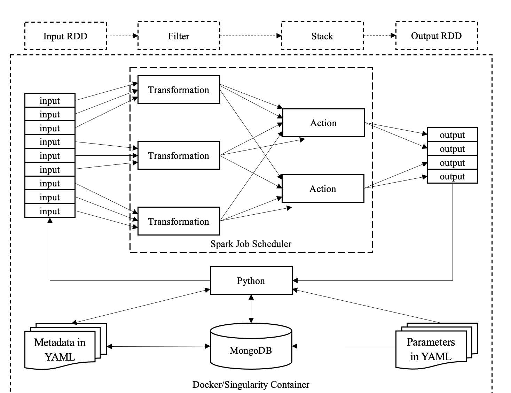

.. _parallel_processesing:

Parallel Processing
===========================
Introduction
~~~~~~~~~~~~~~~~~
One of the primary goals of MsPASS was a framework to make
parallel processing of seismic data no more difficult than running
a typical python script on a desktop machine.   In modern IT lingo
our goals was a "scalable" framework.  The form of parallelism we
exploit is a one of a large class of problems that can reduced to
what is called a directed cyclic graph (DAG) in computer science.
Any book on "big data" will discuss this concept.
Chapter 1 of Daniel (2019) has a particularly useful description using
a cooking analogy.  Our framework supports two well developed systems
for handling such problems called Spark and Dask.
Dask is the default.

An important perspective on this issue is that classical seismic processing systems
concepts are well matched to the DAG Dask and Spark use for scheduling.  Classic
seismic reflection processing systems runs a data set through a series of
processing algorithms.  Each processor acts on either a single signal at
at time (e.g. time-domain filtering) or a group of signals (what we call
a TimeSeriesEnsmble in MsPASS) to produce an output of one or more modified
signals.   e.g. stacking takes an ensemble and produces a single output
while migration takes an input ensemble and produces a (modified) ensemble.
All these examples can be implemented in MsPASS framework to take advantage
of the repetitious nature of the processors.  That is, all can be the thought of
as black boxes that take one or more seismic data objects as input and emit
one or more modified data objects (not necessarily of the same type or number as
the inputs).  A full processing workflow is assembled by chaining a series of
processing steps with data moving between the processing steps by a system
dependent process.   Dask and Spark generalize this by fragmenting the processing
into multiple processors and/or nodes moving the data between steps by a
process largely opaque to you as the user.  An added benefit that is less
obvious is that lower-level parallel granularity is possible for a
python function designed to exploit the capability.  This user manual,
however, focuses exclusively on algorithm level granularity.   We refer
the reader to extensive printed and online documentation for Dask and Spark
for functionality needed to add parallelism inside an individual python
function.

Data Model
~~~~~~~~~~~~

A key concept to understand about both Spark and Dask is the data model.
A simple way to view the concept is that we aim to break "our data"
into a finite set of *N* things (objects) that are each to be handled
identically.   The raw input to any complete seismic data set fits this
idea;  the "data set" is a set of *N* raw signals.  A serial version of
processing a typical data set could be reduced to a loop over each of the *N*
objects applying one or more algorithms to each datum one at a time.   In Spark
and Dask the data are treated collectively as a single data set.
The "data set" is abstracted by a single container that is used
to symbolically represents the
entire data set even though it (normally) is not expected to fit in the
computer's memory.   Spark refers to this abstraction as a
Resiliant Distributed Dataset (RDD) while Dask calls the same thing a "bag".

In MsPASS the normal content of a bag/RDD is a dataset made up of *N*
MsPASS data objects:  TimeSeries, Seismogram, or one of the ensemble of
either of the atomic types.   An implicit assumption in the current
implementation is that any processing
was proceeded by a data assembly and validation phase.
Procedures for data import and data validation
are described in the section :ref:`importing_data`.
A key concept here is that "importing" a data set to MsPASS means the
entire data set has been assembled and loaded either into the gridfs
file system internal to MongoDB or an index has been built for all data
stored in local or cloud-based files.   The entire data set can, if necessary,
be a mix of the two
because the MsPASS readers abstract the entire process of loading data
for processing.  In addition, any required normalization data (i.e.
data in the *site*, *channel*, and/or *source* collections) must be
loaded and cross-referencing validated as described in :ref:`database_normalization`.
Once the data set is fully assembled the bag/RDD defining the abstraction of the
data is easily defined by a variant of the following code section:

.. code-block:: python

  from mspasspy.db.client import DBClient
  from mspasspy.db.database import (Database,
                       read_distributed_data)
  dbclient=DBClient()
  dbname='exampledb'   # This sets the database name - this is an example
  dbhandle=Database(dbclient,dbname)
  query={}
  # code here can optionally produce a valid string defining query
  # as a valid MongoDB argument of for find method.  Default is no query
  cursor=dbhandle.wf_TimeSeries.find(query)
  # Example uses no normalization - most read use normalize (list) argument
  mybag=read_distributed_data(dbhandle,cursor)
  # For spark this modification is needed - context needs to be defined earlier
  #myrdd=read_distributed_data(dbhandle,cursor,format='spark',spark_context=context)

The final result of this example script is a dask bag (RDD for the commented
out variant), which here is
assigned to the python symbol *mybag*.  The bag is created by
the MsPASS *read_distributed_data* function from the "cursor" object returned by
the MongoDB find method.  A "cursor" is an iterable form of a list that
utilizes the same concept as Spark and Dask - the full thing does not
always exist in memory but is a moving window into the data set.
The *read_distributed_data* function is more or less a conversion between
external storage and the processing framework (Dask or Spark) that use
a common concept of a buffered list.

Functional Programming Concepts
~~~~~~~~~~~~~~~~~~~~~~~~~~~~~~~~~~~~~~~~~~~~~~~~~~
Overview
-----------
A second key concept we utilize for processing algorithms in MsPASS is the
abstraction of
`functional programming <https://en.wikipedia.org/wiki/Functional_programming>`__,
which is a branch of programming founded on
`lambda calculus <https://en.wikipedia.org/wiki/Lambda_calculus>`__.
For most seismologists that abstraction is likely best treated only as
a foundational concept that may or may not be helpful depending on your
background. It is important, however,
because all the parallel processing algorithms utilize a functional
programming construct to run an algorithm on a dataset abstracted with
a bag or RDD.  There are two forms we use in MsPASS with these general forms:

.. code-block:: python

  x=y.map(functional)

and

.. code-block:: python

  x=y.accumulate(functional)

Noting that Spark calls the later operation the (more common) name *reduce*.

These two constructs can be thought of as black boxes that handle inputs
as illustrated below in Figure :numref:`map_reduce_figure`:

.. _map_reduce:

     Figure :numref:`map_reduce_figure`.  Illustration of map-reduce concepts.
     The boxes labeled "Transformation" are map operators and those
     labeled "Action" are reduce operators.  Both are alternative terms used
     by some sources for the same concepts. The top boxes illustrate the
     overall workflow as four steps.   The middle section shows how that
     would be fragmented and handled as distinct tasks by Spark (Dask is similar).
     The lower set of boxes illustrate how other component of MsPASS interact
     with Spark/Dask.

We expand on the map/transformation and reduce/action operators in subsection
below.

The map operator
--------------------

A *map* operator takes one input and emits a modified version of
the input as output.  The inputs and outputs of a map are often the same type (e.g. a time-invariant filter),
but not always (e.g the *bundle* algorithm takes a TimeSeriesEnsemble as
and input and emits a SeismogramEnsemble).   A concrete example for
the application of a simple filter in dask is:

.. code-block:: python

  # Assume dbhandle is set as a Database class as above
  cursor = dbhandle.wf_TimeSeries.find({})
  d_in = read_distributed_data(dbhandle,cursor)
  d_out = d_in.map(signals.filter, "bandpass", freqmin=1, freqmax=5, object_history=True, alg_id='0')
  d_compute = d_out.compute()

This example applies the obpsy default bandpass filter to all data
stored in the wf_TimeSeries collection for the database to which dbhandle
points.  The *read_distributed_data* line loads that data as a Dask bag
we here call *d_in*.  The map operator applies the algorithm defined by
the symbol *signals_filter* to each object in *d_in* and stores the
output in the created (new) bag *d_out*.    The last line is way you tell dask to
"go" (i.e. proceed with the calculations) and store the computed result in the *d_compute*.
The idea and reasons for the concept of of "lazy" or "delayed"
operation is discussed at length in various sources on dask (and Spark).
We refer the reader to online sources easily found by searching for
the keyword for more on this general topic.
The final output, which we chose above to give a new symbol name
of :code:`d_compute`, is a list containing the processed data.

The same construct in Spark, unfortunately, requires a different set of
constructs for two reasons:  (1) pyspark demands a functional
programming construct called a lambda function, and (2) spark uses a
different construct for handling delayed computations.  The following
example is the translation of the above to Spark:

.. code-block:: python

  # Assume dbhandle is set as a Database class as above and context is
  # Spark context object also created earlier
  cursor=dbhandle.wf_TimeSeries.find({})
  d_in=read_distributed_data(dbhandle,cursor,format='spark',spark_context=context)
  d_out=d_in.map(lamda d : signals.filter(d,"bandpass", freqmin=1, freqmax=5, object_history=True, alg_id='0'))
  d_compute=d_out.collect()

Notice the call to map in spark needs to be preceded by a call to the *parallelize*
method of the SparkContext object, which is called inside *read_distributed_data*.
That operator is more or less a constructor for the container that Spark
calls an RDD that is assigned the symbol d_out in the example above.
The following line, which from a programming perspective is a call to the map method of the RDD we call
d_out, uses the functional programming construct of a lambda function.
This tutorial in `realpython.com <https://realpython.com/python-lambda/>`_
and `this one <https://www.w3schools.com/python/python_lambda.asp>`_ by w3schools.com
are good starting points.

Both scripts create a final processed data set python associates
with the symbol :code:`d_compute`.   A potentially confusing issue for
beginners is that the content of :code:`d_compute` are largely opaque.
The reason is that both a bag and RDD are designed to handle a data set
that will not fit in memory.  Dask and Spark have different methods
for disaggregating the container, but most MsPASS workflows would normally
terminate with a database save operation.

Reduce/fold operators
-------------------------
A second parallel construct we use is the the `Reduce` clause of the `MapReduce`
paradigm that was a core idea in Hadoop
(see for example the document in `this link <https://www.talend.com/resources/what-is-mapreduce/>`_ )
that was the ancestor of both Spark and Dask.

The generic problem of stacking (averaging) a set of signals
is an example familiar to all seismologists that can be used to illustrate
what a `Reduce` operator is.
The following is a crude MsPASS serial implementation of
stacking all the members of an ensemble:

.. code-block:: python

  ensemble = db.read_ensemble_data(cursor)
  stack = TimeSeries(d.member[0])
  for i in range(len(d.member) - 1):
      stack += ensemble.member[i + 1]

That code is pretty simple because the += operator is defined for the TimeSeries
class and handles time mismatches.  It is not robust for several reasons and
could be done other ways, but that is not the key point.  The point is
that the operation is summing a set of TimeSeries objects to produce the
single result stored with the symbol :code:`stack`.

We will get to the rules that constrain `Reduce` operators in a moment, but
it might be more helpful to you as a user to see how that algorithm
translates into dask/spark.  MsPASS has a parallel :py:func:`stack <mspasspy.reduce.stack>` algorithm.
It is used in a parallel context as follows for dask:

.. code-block:: python

  res = ddb.fold(lambda a, b: stack(a, b))

For spark the syntax is identical but the name of the method changes to reduce:

.. code-block:: python

  res = rdd.reduce(lambda a, b: stack(a, b))

The :py:func:`stack <mspasspy.reduce.stack>` symbol refers to a python function that is actually quite simple. You can view
the source code `here <https://github.com/mspass-team/mspass/blob/master/python/mspasspy/reduce.py>`_.
It is simple because most of the complexity is hidden behind the +=
symbol that invokes that operation in C++ (`TimeSeries::operator+=` for anyone
familiar with C++) to add the right hand side to the left hand side of
the operator.  The python function is also simplified significantly by
the use of python decorator defined by this line in the stack source code:

.. code-block:: python

  @mspass_reduce_func_wrapper

which is a generic wrapper to adapt any suitable reduce function to MsPASS.

The final issue we need to cover in this section is what exactly is meant
by the phrase "any suitable reduce function" at the end of the previous paragraph?
To mesh with the reduce framework used by spark and dask a function has
to satisfy `the following rules <https://en.wikipedia.org/wiki/Reduction_operator>`_

1. The first two arguments (a and b symbols in the example above)
   must define two instances of the same type
   that are to be combined in some way.
2. The function must return an object of the same type as the inputs.
3. The combination algorithm must be commutative and associative.

The commutative and associative restriction arises because in a parallel setting a type
reduce operation like a summation is done on multiple processors and
eventually summed to a single output.  Which processor does what part of the
sum is completely determined by the scheduler so an order cannot be
assumed.

A simple summary of the role of reduce operators in algorithms is this:
any operator that can be expressed mathematically as a summation operator
is a candidate for a reduce.   The stack example above involves summing
a set of TimeSeries objects, but the approach can be used at lower levels.
In particular, reduce is a commonly used tool to implement threading in
pure python code that implements some summation operation.  Turning the
summation loop into a reduce operator can parallelize the loop.  Users
should consider that approach in writing pure python algorithms.

Schedulers
---------------
As noted previously MsPASS currently supports two different schedulers:
Dask (the default) and Spark.   Both do very similar things but are known
to perform differently in different cluster environments.  Users needing to
push the system to the limits may need to evaluate which perform better in
their environment.

In MsPASS we use Spark and Dask to implement the "master-worker"
model of parallel computing.   The "master" is the scheduler that hands off
task to be completed by the workers.  A critical issue this raises is how
the data is handled that the workers are told to process?  Both Spark
and Dask do that through "serialization".  The schedulers move atomic
data between processes by serializing the data and then having the other
end deserialize it.   How and when that happens is a decision made by
the scheduler.  That process is one of the primary limits on scalability of
this framework.   e.g. it is normal for a single worker calculation to be
much slower than a simple loop implementation because of the serialization
overhead.  The default serialization for both PySpark (The native tongue of
Spark is Scalar.  PySpark is the python api.)
and Dask (Python is the native tongue of Dask.) is pickle.   It is important
to recognize that if you write your own application in this framework the
data object you pass to map and reduce operators must have a pickle operator
defined.  That function needs to be as fast as possible as it will be
called a lot in a parallel environment.

Another limit on scalability of this framework is that before the computations,
Dask and Spark need to create a task graph for task scheduling.
Task scheduling breaks your program
into many medium-sized tasks or units of computation.
These tasks are typically a function call which in MsPASS
usually involves passing a non-trivial amount of data to the task
(one or more seismic data objects).
The schedulers represent these tasks as nodes in a graph
with links between nodes defining how data moves between tasks.
The task scheduler uses
this graph in a way that respects these data dependencies and leverages parallelism where
possible.  Multiple independent tasks can be run simultaneously that are
are data driven. Usually this scheduling
overhead is relatively small unless the execution time for
processing is trivial.

For more information, the dask documentation found
`here <https://docs.dask.org/en/latest/scheduling.html>`_ is a good
starting point..

Examples:
~~~~~~~~~~~~~

Atomic Data Example
-------------------------------
The simplest workflow is one that works only with atomic
data (i.e. TimeSeries or Seismogram objects).  The example
in the Data Model section above is of this type.
The following fragment is similar with a few additional processing steps.
It reads all data indexed in the data base as Seismogram objects,
runs a demean operator,
runs a simple bandpass filter, windows the data to a smaller range
defined by the window_seis function defined at he top, it
using the data start time, and then saves the results.

.. code-block:: python

  cursor = db.wf_Seismogram.find({})
  # read -> detrend -> filter -> window
  # example uses dask scheduler
  data = read_distributed_data(db, cursor)
  data = data.map(signals.detrend,'demean')
  data = data.map(signals.filter,"bandpass", freqmin=0.01, freqmax=2.0)
  # windowing is relative to start time.  300 s window starting at d.t0+200
  data = data.map(lambda d : WindowData(d, 200.0, 500.0, t0shift=d.t0))
  res = data.map(db.save_data,collection="wf_Seismogram")
  data_out = data.compute()

Ensemble Example
----------------------
This example shows a common construct used to build ensembles as the
working data object.  In this case the workflow is working with what
in reflection processing would be called a common-source-gather.
It uses a construct that exploits MongoDB's functionality for selecting
data.  It also demonstrates how a map operator can have drastically
different inputs than outputs.   In this case, we first assemble
a list of sources to be process defined by the :code:`source_id` attribute.
This example uses a MongoDB incantation to get a list of unique source_id values.
It then converts the list to a dask bag (:code:`bag.from_sequence` line).
We then apply the custom function defined at the top of this code block to
query MongoDB and return a ensemble of all data with that particular source id.
It then applies a set of signal processing algorithms similar to above noting
how the MsPASS functions automatically handle the type switch.

.. code:: python

  def read_common_source_gather(db,collection,srcid):
    dbcol = db[collection]
    query = {"source_id" : srcid }
    # note with logic of this use we don't need to test for
    # no matches because distinct returns only not null source_id values dbcol
    cursor = dbcol.find(query)
    ensemble = db.read_ensemble(db, collection=collection)
    return ensemble

  dbcol = db.wf_Seismogram
  srcidlist = db.wf_Seismogram.distinct("source_id")
  data = dask.bag.from_sequence(srcidlist)
  data = data.map(lambda srcid : read_common_source_gather(db, "wf_Seismogram", srcid))
  data = data.map(signals.detrend, 'demean')
  data = data.map(signals.filter, "bandpass", freqmin=0.01, freqmax=2.0)
  # windowing is relative to start time.  300 s window starting at d.t0+200
  data = data.map(lambda d : WindowData(d, 200.0, 500.0, t0shift=d.t0))
  data_out = data.compute()
